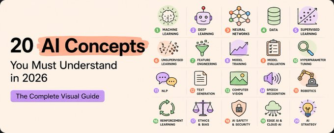

# 20 Concepts To Understand AI in 2026

A field guide to the twenty ideas that explain how modern AI actually works — from the single neuron up to the systems behind the products in daily use. Each chapter takes one concept, explains it in plain language, shows how it works under the hood, and brings it up to date with 2026 best practice. Every substantive claim links to a verifiable source.

The twenty concepts are grouped into four parts that build from foundations to finished systems. Read them in order for the full arc, or jump to whichever concept is needed.

## Part 1 — How AI actually works

_The foundation everything is built on._

1. [Neural Networks](101-neural-networks.md)
2. [Tokenisation](102-tokenisation.md)
3. [Embeddings](103-embeddings.md)
4. [Attention](104-attention.md)
5. [Transformers](105-transformers.md)

## Part 2 — How LLMs work

_What is actually happening when you chat with AI._

6. [Large Language Models](206-llms.md)
7. [Context Window](207-context-window.md)
8. [Temperature](208-temperature.md)
9. [Hallucination](209-hallucination.md)
10. [Prompt Engineering](210-prompt-engineering.md)

## Part 3 — How AI models improve

_How raw models become useful products._

11. [Transfer Learning](311-transfer-learning.md)
12. [Fine-Tuning](312-fine-tuning.md)
13. [RLHF — Reinforcement Learning from Human Feedback](313-rlhf.md)
14. [LoRA — Low-Rank Adaptation](314-lora.md)
15. [Quantisation](315-quantisation.md)

## Part 4 — How real AI systems are built

_What is behind the products you actually use._

16. [RAG — Retrieval-Augmented Generation](416-rag.md)
17. [Vector Databases](417-vector-databases.md)
18. [AI Agents](418-ai-agents.md)
19. [Chain of Thought](419-chain-of-thought.md)
20. [Diffusion Models](420-diffusion-models.md)

## Closing

- [Recap](501-recap.md) — how the four parts fit together into one picture
- [References](502-references.md) — every source cited, in one place

## Sources & credits

The list of twenty concepts is adapted from a thread by [@sairahul1](https://xcancel.com/sairahul1/status/2057740928908161461?s=43) (and its [continuation](https://xcancel.com/sairahul1/status/2058103035969351896?s=43)). The anchor reference throughout is Stanford's [CS229 guest lecture, _Building Large Language Models_](https://www.youtube.com/watch?v=9vM4p9NN0Ts), by Yann Dubois. Per-chapter sources and full attribution are collected in the [references](502-references.md).
