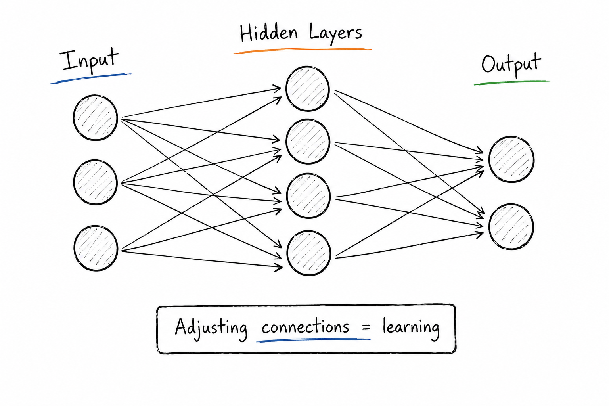

# Billions of Tiny Dials

## Concept 1 of 20 · Part 1: How AI actually works

Every system in this guide — the chatbots, the image generators, the coding assistants — runs on the same underlying machine: the neural network. It is the foundation everything else is built on, and it is far simpler than the mystique around it suggests.

### What it is

A neural network is a single mathematical function. A large one, but a function all the same: numbers go in, numbers come out. What makes it special is how it is built — from layers of small, near-identical units (loosely called "neurons"), wired together so that data flows from an **input layer**, through one or more **hidden layers**, to an **output layer** that produces a prediction.

Every connection between two neurons carries a **weight**: a single number that says how much the signal on that connection should count. A network can have anywhere from thousands to hundreds of billions of these weights, also called **parameters**. They are the entire memory of the model. Nothing else is stored — not rules, not facts, not logic. Just weights. Picture them as billions of tiny dials, and the network's "knowledge" as one particular setting of all those dials at once.

### How it works

Each neuron does something unremarkable: it adds up its incoming signals, each multiplied by its weight, adds a small offset (a **bias**), and passes the result through a simple non-linear function — an **activation**, such as the now-standard ReLU, which keeps positive values and zeroes out negatives. One neuron is trivial. The power comes from stacking them: layers of weighted sums separated by non-linearities can, in principle, approximate almost any relationship between input and output. [3Blue1Brown's visual walkthrough](https://www.youtube.com/watch?v=aircAruvnKk) is the clearest way to actually _see_ this happening.

The obvious question is where the weights come from. They are **learned**, through training, and the recipe is the same everywhere:

1. Show the network an example and let it produce an output.
2. Measure how wrong that output is, using a **loss** function.
3. Work out, for every weight, which direction would nudge it to make the loss a little smaller — its **gradient**. The algorithm that computes all these gradients efficiently, layer by layer, is **backpropagation**.
4. Nudge every weight a tiny step in that direction. This is **gradient descent**.

Run that loop billions of times over a mountain of examples and the dials gradually settle into a configuration that produces useful outputs. No single step is clever; the capability is an emergent property of the scale. The standard reference for the underlying mathematics is the freely available [_Deep Learning_](https://www.deeplearningbook.org) textbook by Goodfellow, Bengio, and Courville.

### State of the art in 2026

Here is the surprise: the core idea has barely changed since the 1980s. A modern frontier model is still layers of weighted units trained by gradient descent. What changed is everything _around_ the idea:

- **Scale.** Parameter counts have grown by orders of magnitude. OpenAI's [GPT-3](https://arxiv.org/abs/2005.14165) was published in 2020 with 175 billion parameters; today's frontier models are larger still, though most vendors no longer disclose exact figures — so any specific "trillions" number quoted online is an estimate, not a published fact.
- **Architecture.** The arrangement of the layers matters enormously. The breakthrough was the **transformer** and its **attention** mechanism — the subjects of Concepts 4 and 5 — which let a network process a whole sequence at once.
- **Compute and training craft.** Specialised hardware (GPUs and TPUs), plus refinements like residual connections, normalisation, and adaptive optimisers, made it practical to train very deep networks without them stalling.

The throughline is worth holding onto: scaling a simple, well-understood mechanism turned out to be astonishingly effective. Stanford's CS229 guest lecture [_Building Large Language Models_](https://www.youtube.com/watch?v=9vM4p9NN0Ts) is a clear hour on how that scaling is done in practice.

### Why it matters

Once you accept that a model is "a stack of weighted connections tuned by training", the rest of AI stops being magic and becomes engineering. Tokenisation, embeddings, attention, fine-tuning, RLHF — every concept that follows is either a way of feeding data into this machine, a way of arranging its layers, or a way of adjusting its dials. The neural network is the substrate; everything else is technique.

### A common misconception

Neural networks are often said to "work like the human brain". They were loosely _inspired_ by biological neurons, and the vocabulary stuck, but a trained network is a mathematical function optimised by gradient descent, not a simulation of biology. The brain metaphor is a helpful on-ramp to intuition; it is not the mechanism, and taking it literally tends to mislead.

---

_Next: [Tokenisation](102-tokenisation.md) — how text becomes something a network can read. Full sources in the [references](502-references.md)._
