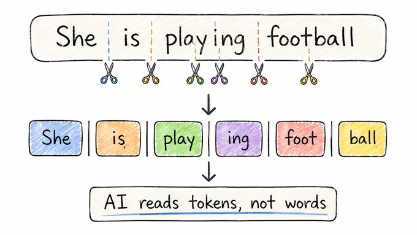

# The Pieces Before Words

## Concept 2 of 20 · Part 1: How AI actually works

Before a language model reads a single word, it breaks text into much smaller fragments called **tokens**. These are the actual units the model works with — and they rarely correspond to what most people expect. "Playing" becomes "play" and "ing". "ChatGPT" becomes "Chat", "G", and "PT". "Dog" may survive intact. The tokenisation step looks almost trivially mechanical, but the choice of how to do it shapes everything the model can see, express, and reason about.

### What it is

A token is the smallest unit of text that a language model processes. Rather than working with characters (too granular — the model would need to learn everything from scratch for every word) or whole words (too rigid — the vocabulary would be impossibly large and would collapse whenever it encountered an unfamiliar word), modern models use **sub-word tokens**: fragments that sit between the two extremes. A typical production vocabulary contains tens of thousands of distinct tokens, covering common whole words as short suffixes, prefixes, punctuation, and fragments of longer or rarer words. Even a word the model has never seen in training can be assembled from pieces it has.

A useful rough rule: one token is approximately 0.75 English words, or about four characters. A prompt of 1 000 words is roughly 1 300 tokens; a 100 000-token context window holds somewhere around 75 000 words. These ratios shift for other languages — code is often denser, while languages with rich morphology can require many more tokens per concept than English.

### How it works

The dominant method for building sub-word vocabularies is **Byte-Pair Encoding (BPE)**, introduced for neural machine translation by [Sennrich, Haddow, and Birch](https://arxiv.org/abs/1508.07909). The algorithm is deceptively simple: start with a vocabulary of individual characters; repeatedly find the most frequent pair of adjacent tokens in a training corpus and merge them into a new single token; repeat until the vocabulary reaches the target size. Common sequences like "ing", "tion", or " the" get merged early and become single tokens. Rare sequences remain as fragments or character runs. The result is a vocabulary that efficiently compresses common language while still being able to spell out anything.

At inference time, a **tokeniser** splits incoming text using the vocabulary produced by that BPE process. OpenAI's [tiktoken](https://github.com/openai/tiktoken) library is a widely used, high-performance implementation of this. The tokeniser is deterministic: given a fixed vocabulary, the same input always produces the same token sequence. Crucially, the vocabulary is fixed at training time — a model cannot learn new tokens without retraining.

[Andrej Karpathy's lecture on building a GPT tokeniser from scratch](https://www.youtube.com/watch?v=zduSFxRajkE) is the clearest available walkthrough of why these design choices matter in practice, including the surprising edge cases that BPE produces.

### State of the art in 2026

BPE and its close relative SentencePiece remain the standard across frontier models. The vocabulary sizes in common use range from roughly 32 000 tokens (GPT-2 era) to 100 000 or more in current models, which improves compression and reduces the token count for non-English text. Extending vocabularies for multilingual and code-heavy use cases is an active area: larger vocabularies mean fewer tokens per sentence in low-resource languages, which directly affects what fits inside a context window.

One practical shift in 2026: users and developers are increasingly aware of tokenisation as a cost and capability lever. API pricing is per token, so prompt compression matters economically. More importantly, arithmetic, spelling, and character-level reasoning tasks remain harder for LLMs partly because of tokenisation — the model never sees individual letters as first-class units, only the fragments BPE decided to merge.

### Why it matters

Tokenisation is the first transformation between human text and model computation, and its choices propagate through everything downstream. The same model can process a French or Japanese prompt far less efficiently than an English one because those languages tokenise worse under a vocabulary trained on English-heavy data. Unusual spellings, code identifiers, and URLs can fragment into long token sequences that consume context and confuse the model. Understanding tokenisation is the difference between thinking of the model as "a reader" and understanding it as "a function over integer sequences" — which is the more accurate and more useful frame.

### A common misconception

It is tempting to assume that because tokens often look like words, the model is reasoning in words. It is not. The model operates entirely on token IDs — integers indexing into the vocabulary — and then on the vectors those IDs are mapped to. The relationship between a token and its spelling is established at training time and never revisited during inference. When a model misspells a word or fails to count letters correctly, that is usually a tokenisation effect: the model simply does not have direct access to character-level structure.

---

_Next: [Embeddings](103-embeddings.md) — how those integer tokens become meaningful positions in space. Full sources in the [references](502-references.md)._
