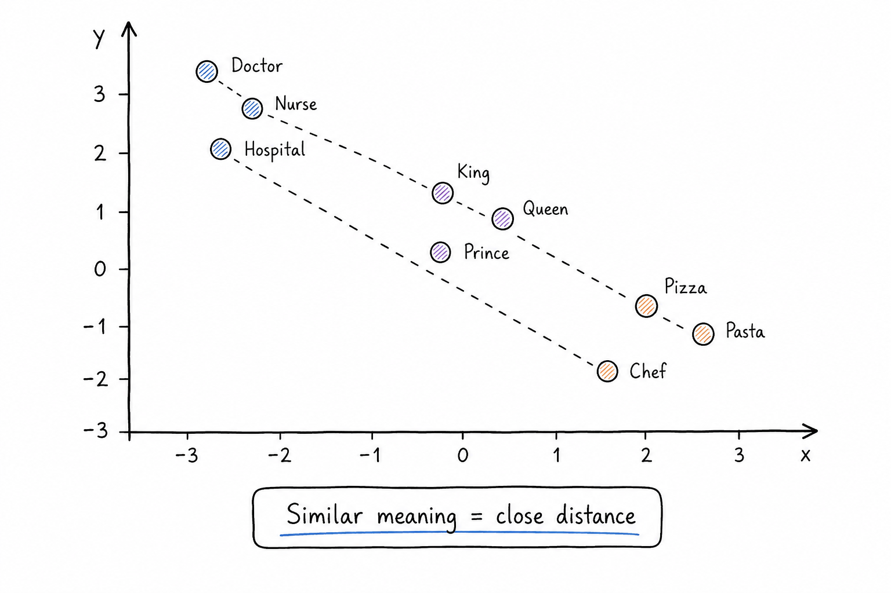

# Words Become Coordinates

## Concept 3 of 20 · Part 1: How AI actually works

A language model cannot do arithmetic on text. Before a token can be processed by the layers of a neural network, it must become numbers — not a label or a category, but a dense list of numbers that somehow carries meaning. This transformation is called an **embedding**, and it is the step that turns the question "what is this token?" into something a model can reason about: "where does this token sit in meaning-space?"

### What it is

An embedding is a vector — a list of floating-point numbers — that represents a token's meaning as a position in a high-dimensional space. Each token in the model's vocabulary is assigned one such vector, and the vectors are learned during training. The key insight is that geometric relationships in this space can mirror semantic ones: tokens with similar meanings cluster together, while unrelated tokens sit far apart.

The classic illustration comes from early work by [Mikolov et al.](https://arxiv.org/abs/1301.3781) on word2vec: in a trained embedding space, the vector for "king" minus "man" plus "woman" lands close to the vector for "queen". The model was never told that kings and queens are royalty, or that gender is a dimension — it inferred these structural relationships purely from patterns in which words appeared near which other words across a large corpus. "Doctor" and "nurse" cluster together not because someone labelled them as medical roles, but because both appear in similar textual contexts.

### How it works

The mechanism is straightforward. The embedding layer is simply a large lookup table: a matrix with one row per vocabulary token, and one column per embedding dimension. A token ID becomes a vector by selecting that row. In a model with a vocabulary of 100 000 tokens and an embedding dimension of 4 096, this table has 409 million entries — and every value is a learned parameter, updated through backpropagation just like every other weight in the network.

Training teaches the embeddings indirectly. The model is asked to predict masked or next tokens from context, and the error signal propagates back through the embedding table, gradually pushing vectors for tokens that appear in similar contexts closer together in space. No one hand-labels semantic similarity; it emerges from the co-occurrence statistics in the training data. [Jay Alammar's illustrated guide to word2vec](https://jalammar.github.io/illustrated-word2vec/) remains the most readable visual explanation of how this learning process works.

By the time processing reaches the attention layers (Concept 4), each token is carrying its full embedding vector into the computation. Subsequent layers transform and refine these vectors as information flows through the network — but the embedding is where meaning first enters the calculation.

### State of the art in 2026

Modern large models use far higher embedding dimensions than the original word2vec experiments (typically hundreds to thousands of dimensions rather than dozens), and they embed at the sub-word token level rather than the whole-word level. The basic structure — learned lookup table, trained by gradient descent, position in space stands in for semantic relationship — has not changed fundamentally since word2vec, though the scale has grown by orders of magnitude.

Embeddings have also become a first-class product independent of language generation. Dedicated embedding models — trained specifically to produce vectors useful for similarity comparison — power semantic search, recommendation engines, duplicate detection, and retrieval-augmented generation (Concept 16). Querying by meaning rather than by keyword is now a standard engineering pattern, built on embedding vectors from models like OpenAI's `text-embedding-3` series or the open-weight equivalents. The distance between two embedding vectors has become a practical unit of measurement in production systems.

### Why it matters

Embeddings are the bridge between the symbolic world of language and the numerical world of computation. Without them, a neural network has no way to represent a token's relationship to any other token — each token would be just an arbitrary integer. With them, the network can generalise: a model that learned "dog" can apply that knowledge to "dogs", "puppy", and "canine" because they sit nearby in the same space.

The reach of embeddings extends well beyond text. Images, audio, and structured records can all be mapped to the same kind of vector space, which is how multimodal models and cross-domain retrieval systems work: they share a coordinate system where a photo of a dog and the phrase "dog photo" land close together, even though their raw formats are completely different.

### A common misconception

The king-minus-man-plus-woman analogy is vivid, but it can give the impression that embedding spaces are tidy and interpretable. In practice, high-dimensional spaces are strange: distances and angles that seem meaningful in two or three dimensions behave differently with hundreds or thousands of dimensions. The analogy holds well enough to build useful systems, but the geometry is not as clean or as human-readable as the classic illustration suggests. Embeddings are optimised for task performance, not for being easy to visualise.

---

_Next: [Attention](104-attention.md) — how the model decides which parts of the sequence to focus on. Full sources in the [references](502-references.md)._
