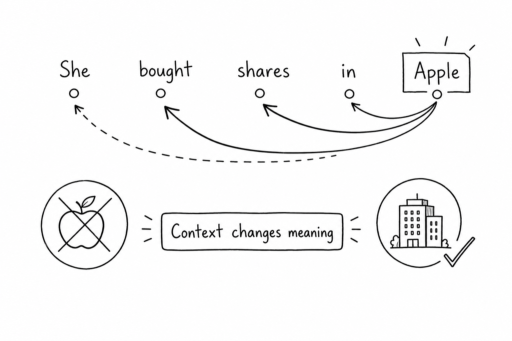

# Letting Words Look Around

## Concept 4 of 20 · Part 1: How AI actually works

The word "Apple" carries a different meaning in "I ate an apple" than in "I bought Apple stock". An embedding vector (Concept 3) captures something average of those meanings — not wrong, but not precise either. To resolve ambiguity, a model needs to know what surrounds the word it is processing. **Attention** is the mechanism that provides exactly this: for each token, a learned way of looking at the rest of the sequence and deciding what to weigh.

### What it is

Attention is a function that lets any token in a sequence gather information from any other token, weighted by relevance. Instead of processing each token in isolation, an attention layer computes, for every token, a weighted sum of the vectors of all other tokens — where the weights reflect how relevant each other token is to resolving the current one. "Apple" in a financial context will draw strong weight from "stock" and "bought", effectively shifting its representation toward the corporate sense.

The mechanism is not hand-coded heuristics about which words typically co-occur. The weights are computed dynamically, from the content of the sequence itself, through learned linear projections. The model learns what kinds of relationships to look for; the actual relationships are computed fresh for every input.

### How it works

The standard formulation, introduced by [Vaswani et al.](https://arxiv.org/abs/1706.03762), represents each token's contribution to an attention calculation through three learned projections: a **query** (what this token is asking for), a **key** (what this token offers to others), and a **value** (the information it will actually pass along if selected). The attention weight between two tokens is computed as the dot product of one token's query with the other's key, scaled and passed through a softmax to produce a probability distribution. The output is then the weighted sum of all value vectors, weighted by those probabilities.

This query-key-value formulation lets the model learn very different kinds of relationships in different attention layers. One layer might attend to syntactic structure; another to coreference (tracking what a pronoun refers to); another to long-range topical coherence. Production models stack many layers of attention, each building on the representations left by the previous one.

The foundational idea of attention in sequence models predates transformers. [Bahdanau, Cho, and Bengio](https://arxiv.org/abs/1409.0473) introduced an earlier form specifically to help recurrent networks for machine translation decide which part of a source sentence to consult when generating each target word. The 2017 Vaswani et al. paper then made attention the entire mechanism, discarding the recurrent structure entirely — the subject of Concept 5. [Jay Alammar's illustrated walkthrough of the transformer](https://jalammar.github.io/illustrated-transformer/) makes the query-key-value mechanics easier to follow than any prose description can.

### State of the art in 2026

Standard self-attention has a quadratic cost: every token attends to every other token, so doubling the sequence length quadruples the computation. Extending context windows to hundreds of thousands of tokens — now common in frontier models — required finding ways around this. Techniques such as grouped-query attention, sliding-window attention, and linear approximations have each been deployed at scale to manage the cost while preserving the benefit of long-range information flow.

Multi-head attention, also introduced in the original Vaswani et al. paper, runs many attention computations in parallel within a single layer, each with its own query-key-value projections. This lets a single layer capture multiple different kinds of relationship simultaneously — syntax and semantics and reference, for example, all at once — rather than being forced to blend them into a single weighted sum.

### Why it matters

Attention reshaped how language models work. Before it, models processed sequences one step at a time, with information about earlier tokens degrading as the sequence grew longer. Attention makes the full sequence available to every computation at once, and does so in a way that parallelises efficiently on modern hardware. That combination — global access plus parallelism — is what made training at today's scale practical, and it is why the transformer (Concept 5) displaced the recurrent architectures that came before.

For practitioners, attention is also the mechanism behind many of the interpretability tools people reach for when trying to understand what a model is doing. Examining attention weights can reveal which parts of a prompt the model is drawing on when producing a given output — though those weights are a partial and sometimes misleading window into the actual computation.

### A common misconception

Attention weights are sometimes treated as a reliable explanation of model reasoning: "the model attended strongly to word X, therefore word X caused the output." The weights tell you where information was gathered from, but the model's actual decision emerges from the transformed values that flow through many subsequent layers. Attention patterns are a starting point for analysis, not a complete account.

---

_Next: [Transformers](105-transformers.md) — how attention layers are stacked into the architecture behind almost every modern AI model. Full sources in the [references](502-references.md)._
