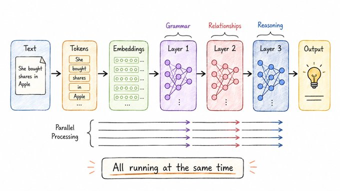

# Reading Everything at Once

## Concept 5 of 20 · Part 1: How AI actually works

The architecture behind almost every significant AI model released since 2018 — language models, code assistants, image generators, protein-folding systems — is the transformer. Not a dozen different architectures each specialised to a task, but one design, applied broadly, scaled up, and refined in details. Understanding the transformer means understanding why modern AI works at all, and why it works at the scale it does.

### What it is

A transformer is a neural network (Concept 1) built from a specific arrangement of layers: primarily **attention** layers (Concept 4) alternating with small **feed-forward networks**, the whole thing wrapped in normalisation steps and residual connections that let gradients flow cleanly during training. Introduced in the 2017 paper [_Attention Is All You Need_](https://arxiv.org/abs/1706.03762) by Vaswani et al., the architecture was designed for machine translation, but the design turned out to generalise far beyond that.

The defining characteristic is that it processes an entire input sequence in parallel rather than one token at a time. This is the difference from the recurrent networks (RNNs and LSTMs) that preceded it: those processed tokens sequentially, carrying forward a hidden state that compressed earlier context — a bottleneck that caused information from distant parts of the sequence to degrade. The transformer has no such bottleneck. Every layer can attend to every position.

### How it works

A transformer is best understood as a stack of identical blocks, each doing the same kind of work at progressively more abstract levels. Each block contains:

1. A **multi-head self-attention** sub-layer, which lets tokens gather information from the full sequence (as described in Concept 4).
2. A **position-wise feed-forward network** — two linear layers with a non-linearity between them — applied independently to each token's vector. This is where most of the network's capacity sits; in large models, the feed-forward layers are much wider than the attention layers.

Both sub-layers use **residual connections**: the input to the sub-layer is added back to its output, so the block is learning a correction to what was already there rather than a complete transformation. This lets gradients flow back through dozens of stacked layers without vanishing. Layer normalisation is applied to stabilise training.

A rigorous technical treatment of the full mechanism — covering encoder, decoder, masking, positional encodings, and the cross-attention variant used in encoder-decoder models — is in [Phuong and Hutter's _Formal Algorithms for Transformers_](https://arxiv.org/abs/2207.09238), which is readable without being imprecise.

Sequence order is not implicit in the attention mechanism, which treats the input as a set rather than a sequence. Transformers handle position through **positional encodings** added to the input embeddings — either fixed sinusoidal patterns (the original paper) or learned positional embeddings, or more recent approaches like rotary position embeddings (RoPE) that allow generalisation to lengths longer than those seen during training.

### State of the art in 2026

The 2017 transformer architecture is still recognisable in every current frontier model. What has changed is the surrounding engineering:

- **Scale.** Stacking more layers, widening the feed-forward blocks, and training on far more data have each driven capability gains in a surprisingly predictable way.
- **Decoder-only variants.** The original transformer had both an encoder and a decoder. GPT and its successors use only the decoder half — processing left-to-right with causal masking — which scales more cleanly for language generation. This is the dominant pattern for large language models today.
- **Efficiency refinements.** Grouped-query attention, sparse and mixture-of-experts feed-forward layers, and better normalisation placements (pre-norm rather than post-norm) are now standard. None changes the fundamental design; each reduces cost or improves stability at scale.

[Yann Dubois's CS229 lecture on building large language models](https://www.youtube.com/watch?v=9vM4p9NN0Ts) gives a practitioner's account of how these refinements are assembled into production-scale training runs.

### Why it matters

The transformer is the reason AI looks the way it does in 2026. Previous architectures had hard scaling limits — they got worse, not better, with more layers, more data, or longer sequences. The transformer scales cleanly on all three axes, and modern GPU and TPU hardware is optimised for exactly the matrix operations it requires. The result is that a single architecture covers text, code, images, audio, and protein sequences, across models ranging from tens of millions to hundreds of billions of parameters.

For anyone building with AI — as a developer, a product designer, or an informed user — the transformer is the shared substrate. The context window, the tokenisation, the attention patterns, the distinction between a base model and a fine-tuned one: all of these make sense only in relation to this architecture. Part 2 starts from here and asks what happens when you take a trained transformer and use it as a language model.

---

_Next: [Large Language Models](206-llms.md) — how a trained transformer becomes the AI you can actually talk to. Full sources in the [references](502-references.md)._
