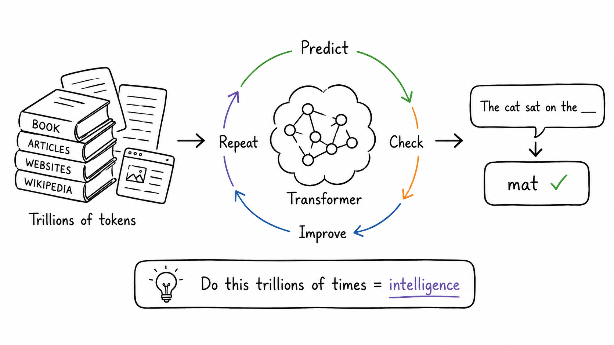

# Autocomplete, Taken to Extremes

## Concept 6 of 20 · Part 2: How LLMs work

Everything in Part 1 — the weighted connections, the tokens, the embeddings, the attention mechanism, the transformer architecture — was prologue. A large language model brings those pieces together and points them at a single, almost absurdly simple objective: given the tokens so far, predict the next one. That is the entirety of the training signal. And yet, when the model is large enough and the text it trains on vast enough, something unexpected emerges: a system that can hold a conversation, summarise a legal document, translate between languages, and write working code. The trick is not a different kind of intelligence. It is scale.

### What it is

A large language model (LLM) is a transformer trained on a very large corpus of text using a **next-token prediction** objective. The corpus typically spans books, websites, scientific papers, and code — anything that can be expressed as a sequence of tokens. During training, the model sees trillions of such sequences and, for each position in each sequence, learns to predict what token comes next. The loss function penalises wrong predictions; gradient descent adjusts the weights to do better.

"Large" has a moving threshold, but the research literature crystallised around the scale demonstrated by [Brown et al.'s GPT-3](https://arxiv.org/abs/2005.14165), which reached 175 billion parameters. That figure — 175B — is the one published frontier number that can be cited with confidence. Subsequent models from most vendors are larger, but exact parameter counts are no longer disclosed; any specific figure cited online for recent models is an estimate, not a published fact.

### How it works

The training setup is a straightforward extension of what the transformer already does. The model receives a sequence of tokens as input, runs them through its layers of attention and feed-forward computation, and produces a probability distribution over every token in the vocabulary for each position. The prediction for position _t_ must only attend to positions before _t_ — a constraint called **causal masking** — so the same forward pass trains on every position in the sequence simultaneously. This is why transformers can exploit parallel hardware so efficiently compared with earlier recurrent architectures.

Once training is complete, generation works by sampling: the model predicts the next-token distribution, one token is drawn from it, that token is appended to the input, and the process repeats. The sampling strategy — how a single token is chosen from the distribution — turns out to matter a great deal; that is the subject of Concept 8 (Temperature).

The question of how much data and how much compute to pair together is addressed by [Hoffmann et al.'s Chinchilla scaling analysis](https://arxiv.org/abs/2203.15556), which showed that the field had systematically undertrained earlier large models. Chinchilla's finding — roughly, that model size and training tokens should scale together rather than pouring all compute into a larger model trained on the same data — reshaped how subsequent models were built. Larger is not always better if the training data has not grown to match.

### State of the art in 2026

The [Stanford CS229 lecture by Yann Dubois](https://www.youtube.com/watch?v=9vM4p9NN0Ts) on building LLMs lays out the engineering pipeline in detail: data curation, tokenisation at scale, distributed training across many accelerators, and the post-training steps that turn a raw next-token predictor into a useful assistant. That last step — instruction following, alignment, RLHF — is covered in Part 3. What matters here is the pre-training foundation.

By 2026 the broad strokes are established: frontier LLMs are trained on trillions of tokens drawn from diverse multilingual sources including code, scientific text, and structured data. Architectures have converged on variants of the original transformer with grouped-query attention and rotary position embeddings. Mixture-of-experts designs route each token through a subset of parameters, allowing effective parameter counts to scale without proportional increases in inference cost. The raw capability ceiling keeps rising, but the recipe remains the same: next-token prediction, at scale, on diverse text.

### Why it matters

The LLM is the first concept in this guide where the emergent properties start to feel surprising. A system trained purely to predict the next token has no explicit module for translation, no separate summarisation routine, no logic engine. Those capabilities appear anyway, as consequences of learning to model language at sufficient depth and breadth. Understanding that the underlying mechanism is still just next-token prediction is the corrective that keeps the technology legible: the model is not "reasoning" in the human sense; it is producing the most probable continuation given everything it has seen in training and in the current context. That framing — plausible continuation, not verified truth — is directly relevant to the concept that follows most urgently: hallucination (Concept 9).

### A common misconception

LLMs are often described as "knowing" facts or "understanding" language. The more precise framing is that they have compressed statistical regularities from the training corpus into weights. When a model gives a correct answer, it is because that answer was the most probable continuation in the distribution it learned — not because it looked up a verified record. When the distribution is thin or the question is ill-posed, the most probable continuation can be completely wrong, stated with full fluency. Scale improves the distribution but does not eliminate this property.

---

_Next: [Context Window](207-context-window.md) — every model has a memory limit, and understanding it changes how you use the model. Full sources in the [references](502-references.md)._
