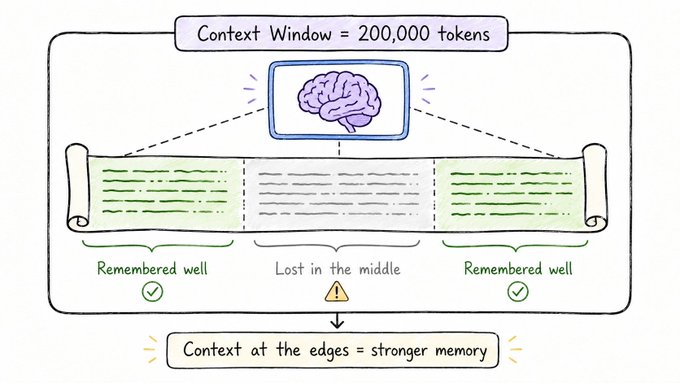

# The Model's Working Memory

## Concept 7 of 20 · Part 2: How LLMs work

Every transformer-based language model has a hard limit on how much text it can process at once. That limit — the **context window** — is measured in tokens, and it encompasses everything the model can see when it generates a reply: your system prompt, the conversation so far, any documents you have pasted in, and the reply the model is currently composing. Exceed the window and the model cannot attend to what has fallen off the edge. Understanding this constraint, and the research that has worked to stretch and sidestep it, is central to understanding what models can and cannot do in practice.

### What it is

The context window defines the maximum sequence length for a single forward pass. At each generation step the model attends, via its attention mechanism (Concept 4), to every token within that window. Because attention computes relationships between every pair of positions, the cost of a forward pass scales with the square of the sequence length — a fundamental pressure that limits how far windows can simply be extended without new techniques.

Window sizes have grown dramatically since the early transformer era. Models that were constrained to 512 or 1024 tokens have given way to systems handling tens or even hundreds of thousands of tokens. But raw size tells only part of the story, because the model also needs a way to distinguish _where_ in the sequence each token sits. That is the job of **positional encoding**: adding information about each token's position before the attention layers process it.

### How it works

Early transformers used fixed sinusoidal positional encodings added directly to the token embeddings. More recent architectures use **Rotary Position Embedding (RoPE)**, described by [Su et al.](https://arxiv.org/abs/2104.09864), which encodes position by rotating the query and key vectors in the attention computation rather than adding a learned offset to the embedding. RoPE has a useful property: it represents position as a _relative_ relationship between tokens rather than an absolute index, which makes it considerably easier to extend the effective context at inference time without retraining from scratch. Most frontier models in 2026 use RoPE or a close descendant.

The mechanics of the window itself are straightforward: tokens are processed left to right in generation, causal masking prevents any position from attending to a later one, and the key-value cache retains the attention states of earlier tokens so they do not have to be recomputed at each step. When the sequence length approaches the window limit, the oldest key-value states are either truncated (they simply disappear) or the model uses a sliding-window or hierarchical strategy to approximate attention over longer ranges.

### State of the art in 2026

By 2026, windows of 128,000 tokens are common among major hosted models, with some systems advertising considerably more. This has made it practical to feed entire codebases, long legal documents, or book-length texts into a single context. The appeal is obvious: instead of chunking a document and retrieving fragments (the RAG approach covered in Concept 16), you can, in principle, simply paste it all in.

The caveat is important, however. [Liu et al.'s "Lost in the Middle" study](https://arxiv.org/abs/2307.03172) demonstrated that models do not use every position in a long context equally well. Information at the very beginning and very end of the window tends to be recalled reliably; information buried in the middle is recalled significantly less well, even when the window is nominally large enough to hold it. The effect weakens with newer models and better positional encodings, but has not vanished. A context window is not a flat random-access memory; it is more like a reading desk where things placed near the edges stay visible and things buried under a pile in the centre can be missed.

### Why it matters

The context window is the practical boundary of the model's attention. Every design choice that practitioners make around document length, conversation history, system-prompt length, and retrieval strategy is ultimately a response to this constraint. Knowing that the window is finite — and that the model's effective recall within it is uneven — explains why RAG systems break documents into chunks, why long system prompts can crowd out conversation history, and why simply extending the window does not automatically solve every retrieval problem.

For most everyday use the window is generous enough that it never becomes an issue. But at the edges — long research sessions, codebases passed as context, multi-turn conversations that run for hours — the limit becomes visible and the architecture's behaviour around it becomes important to understand.

### A common misconception

A larger context window is not a free upgrade. Beyond the computational cost of longer sequences, the "lost in the middle" effect means that a model with a 128K window can still fail to use information that is plainly present in its input if that information is buried far from either end. Retrieval and ordering of content within the window matter as much as the window's nominal size.

---

_Next: [Temperature](208-temperature.md) — the dial that controls how predictable or creative a model's output is. Full sources in the [references](502-references.md)._
