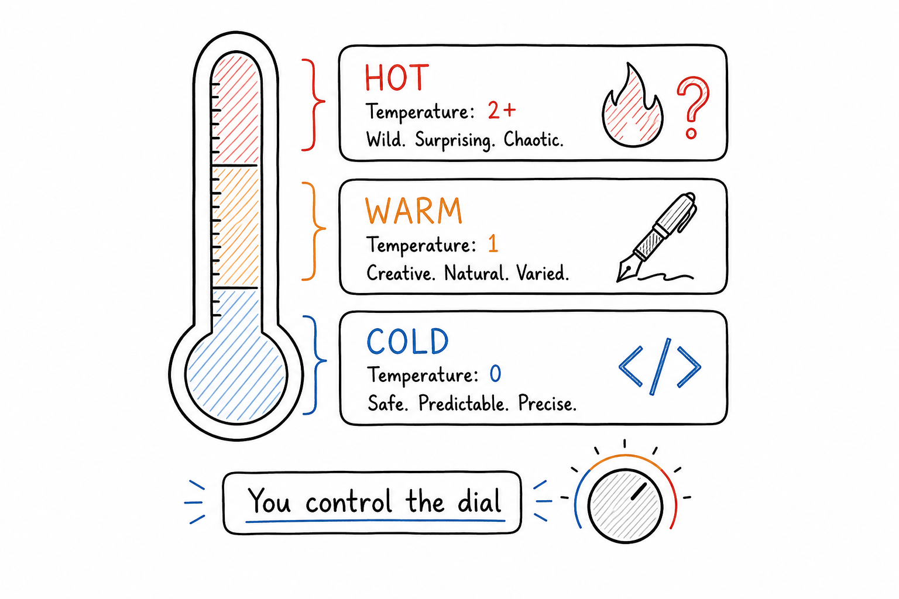

# The Creativity Dial

## Concept 8 of 20 · Part 2: How LLMs work



At the end of every forward pass, the model produces a number for every token in its vocabulary: a raw score indicating how well that token fits as the next continuation. Those scores are turned into a probability distribution, and then a single token is selected from it. The model does not _have_ to pick the most likely option. The degree to which it departs from that safest choice — how much creative latitude is in the system — is controlled by a single scalar parameter called **temperature**. It is one of the most consequential and least understood controls available to anyone using a language model.

### What it is

Temperature is a parameter in the **softmax** function that converts the model's raw output scores (logits) into probabilities. The softmax of a set of logits _z_ at temperature _T_ is:

```
p(token i) = exp(z_i / T) / Σ exp(z_j / T)
```

When _T_ is close to 0, dividing by a small number makes the differences between logits enormous in the exponent, so the highest-scoring token gets a probability close to 1 and everything else approaches 0. The output becomes deterministic: the model always picks the single most likely token. When _T_ is 1.0, the raw logits are used unchanged and the distribution reflects what the model actually learned. When _T_ rises above 1, the logits are compressed toward each other, making unlikely tokens more probable and producing more varied, surprising — and eventually incoherent — output.

### How it works

In practice, temperature is applied immediately before sampling. The generation loop is:

1. Run a forward pass; collect the logits for the next position.
2. Divide each logit by _T_.
3. Apply softmax to get a probability distribution.
4. Sample one token from that distribution.
5. Append the token to the sequence and repeat.

Temperature does not change what the model has learned; it changes how that learning is expressed in the sampling step. A low-temperature model is not "smarter" — it is merely more conservative, always reaching for the statistically central answer. A high-temperature model is not "more creative" in any deep sense; it is drawing from a flatter distribution, so low-probability tokens appear more often. Those tokens can be surprising and generative, or they can be wrong.

Temperature is rarely used alone. [Holtzman et al.'s "Curious Case of Neural Text Degeneration"](https://arxiv.org/abs/1904.09751) showed that naive temperature sampling — even at moderate values — tends to produce text that is locally plausible but globally repetitive or incoherent over long spans, a failure they called "degeneration". Their proposed remedy, **nucleus sampling** (also called top-_p_ sampling), restricts each sampling step to the smallest set of tokens whose cumulative probability exceeds a threshold _p_ (typically 0.9 or 0.95), then resamples within that set. This prevents very low-probability "tail" tokens from being selected even when temperature is high. Most production systems combine a moderate temperature (0.6–1.0) with nucleus sampling and sometimes a **top-k** cutoff that discards all but the _k_ highest-probability tokens before applying softmax.

The generation and decoding strategies are covered in detail in the [Stanford CS229 lecture by Yann Dubois](https://www.youtube.com/watch?v=9vM4p9NN0Ts), which situates temperature within the broader pipeline from raw model output to finished text.

### State of the art in 2026

Most consumer-facing products set temperature and sampling parameters automatically and do not expose them to users. Developer APIs typically offer temperature as a top-level parameter — often in the range 0 to 2 — with some also exposing top-_p_ and top-_k_. The defaults are usually tuned for the intended use case: coding assistants tend toward lower temperatures (higher determinism, less hallucination), creative writing assistants toward higher ones.

Some newer decoding strategies attempt to sidestep the temperature-or-greedy trade-off altogether. Speculative decoding, for instance, uses a small draft model to propose multiple tokens at once, verified in parallel by the larger model, speeding up generation without changing the effective sampling distribution. Contrastive decoding compares the output of a large and small model to suppress generic, high-probability continuations in favour of informative ones. These techniques are still active research territory; temperature as a parameter is likely to remain the most accessible control for practitioners.

### Why it matters

Temperature is the clearest example of how the same model can produce strikingly different outputs with no change to its weights. Setting it too low collapses variety and can cause the model to repeat itself or converge on safe, predictable non-answers. Setting it too high produces energetic nonsense. The sweet spot is task-dependent, and understanding what temperature is _doing_ — reshaping a probability distribution before sampling, not changing the underlying model — is what allows you to dial it appropriately rather than guessing.

The parameter also has a direct relationship to hallucination (Concept 9): at higher temperatures the model is more willing to venture into low-probability territory, which is exactly where confabulated facts live. Keeping temperature modest when factual accuracy matters is one of the simplest and most effective mitigations available before reaching for heavier techniques.

### A common misconception

Temperature is sometimes described as controlling how "confident" the model is. Confidence in the colloquial sense — the model's expressed certainty — is a property of the output text, not of the sampling parameter. A model generating at temperature 0 can produce a confident-sounding wrong answer just as fluently as at temperature 1; it simply picks the _most probable_ confident-sounding wrong answer rather than a varied one. Temperature shapes the diversity of outputs; it does not calibrate the model's epistemic relationship to truth.

---

_Next: [Hallucination](209-hallucination.md) — why models state false things with complete confidence, and what can be done about it. Full sources in the [references](502-references.md)._
