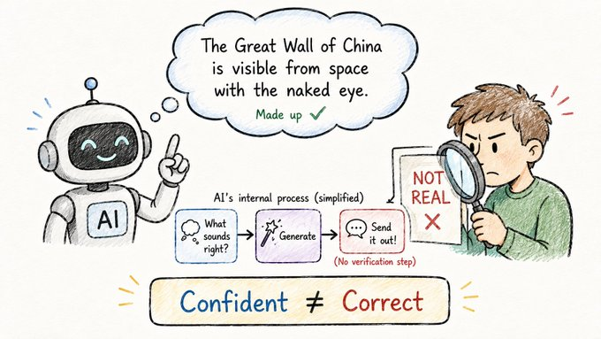

# Confidently Wrong

## Concept 9 of 20 · Part 2: How LLMs work

A language model can describe a scientific paper that does not exist, cite a legal case with the wrong outcome, give a recipe containing a dangerous substitution, and do all of it in smooth, assured prose with no hedging. This is not a bug that will be patched in the next version. It is a property of the mechanism — and understanding why requires returning to the core of what next-token prediction actually does.

### What it is

**Hallucination** is the term the field has settled on for outputs that are fluent, grammatically correct, and factually wrong. The word is borrowed from psychology, where it describes perception without external stimulus. Applied to language models, it captures something real: the model is producing text that _sounds like_ a correct, grounded answer but has no verifiable referent in the world.

[Ji et al.'s survey of hallucination in natural language generation](https://arxiv.org/abs/2202.03629) catalogues the phenomenon across many tasks — summarisation, translation, question answering, dialogue — and distinguishes several kinds: **intrinsic hallucination**, where the model contradicts its own source material, and **extrinsic hallucination**, where it introduces information that is neither supported nor contradicted by any source but simply invented. Both appear in LLMs, and both stem from the same root cause.

### How it works

The model's objective during training is to predict the next token — not to verify truth. The weights encode statistical regularities: which tokens tend to follow which other tokens, across an enormous variety of contexts. When a question is posed in a domain where the training data is rich, the most probable continuation tends to be a correct answer, because correct answers were common in the training text. When the training data is thin, or the question is framed in a way the model has rarely encountered, the most probable continuation is whatever _sounds like_ the right kind of answer in that context — a plausible-sounding continuation, not a verified fact.

This is why hallucinations often have a distinctive texture: they are stylistically appropriate. A hallucinated academic citation has the right format, plausible-sounding author names, a real-looking DOI, a title that fits the subject. The model is not guessing randomly; it is sampling from a learned distribution of what citations look like, without any mechanism to check whether a specific cited work exists.

[Lin, Hilton, and Evans's TruthfulQA benchmark](https://arxiv.org/abs/2109.07958) made this concrete by constructing questions specifically designed to elicit confident incorrect answers — questions where the "human-like" answer that follows familiar patterns is wrong, because the patterns in question encode popular misconceptions or common false beliefs. Larger models, they found, were _more_ susceptible to some of these errors, not less: with greater fluency comes greater confidence in expressing plausible-sounding falsehoods.

### State of the art in 2026

The research community has pursued several strategies to reduce hallucination, none of which eliminates it:

**Reinforcement learning from human feedback (RLHF, Concept 13)** trains models to produce outputs that human raters prefer, which has correlated, imperfectly, with preferring accurate outputs. Models trained with RLHF tend to hedge more and confabulate less, though they can learn to hedge in ways that look calibrated without actually being so.

**Retrieval-Augmented Generation (RAG, Concept 16)** addresses the root cause more directly: instead of relying solely on what the model has memorised, a RAG system retrieves relevant documents at inference time and passes them into the context window for the model to draw on. When the model is anchored to a retrieved document, hallucination on that document's content drops substantially. RAG does not prevent the model from hallucinating about things outside the retrieved material, but it provides a factual anchor for the questions where grounding matters most.

**Factuality-specific fine-tuning and prompting** — asking the model to say "I don't know" when uncertain, or training it on examples of calibrated uncertainty — reduces the most obvious forms of confabulation, though it is difficult to measure calibration reliably.

### Why it matters

Hallucination is the single most consequential failure mode for anyone using language models in high-stakes settings — medicine, law, research, finance. The fluency of the output is precisely what makes it dangerous: a wrong answer that _sounds_ uncertain is easy to catch; a wrong answer that sounds authoritative can propagate undetected. The appropriate response is not to avoid using models but to understand the mechanism well enough to apply them where their limitations are acceptable — and to build grounding systems (RAG, tool use, citation requirements) where they are not.

### A common misconception

Hallucination is often attributed to insufficient training data or model size — the idea being that a bigger, better-trained model will eventually stop making things up. Size and data quality do reduce some categories of error, but TruthfulQA found that scaling alone does not reliably improve truthfulness, and in some cases worsens it. Hallucination is not a calibration problem that disappears at scale; it is an architectural property of systems trained to predict plausible continuations.

---

_Next: [Prompt Engineering](210-prompt-engineering.md) — how the way you frame a question shapes the answer you get. Full sources in the [references](502-references.md)._
