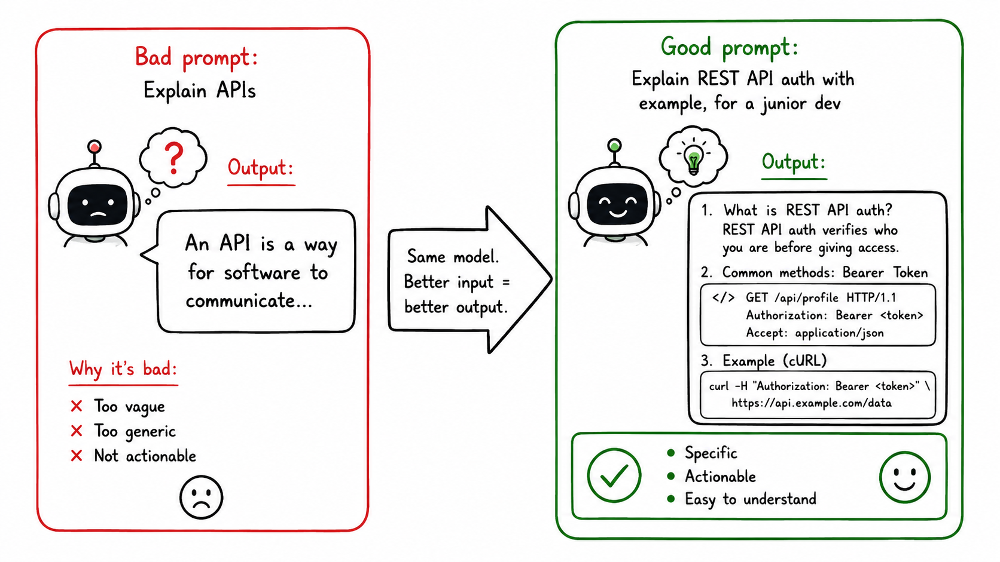

# How You Ask Changes Everything

## Concept 10 of 20 · Part 2: How LLMs work

The weights of a language model are fixed at inference time. The architecture does not change. The training data does not change. And yet the same model, given two differently worded versions of the same question, can produce answers that range from precise and useful to vague and wrong. The difference lies entirely in the input — the prompt. Prompt engineering is the practice of crafting that input deliberately, and understanding why it works returns directly to the next-token prediction mechanism at the core of every LLM.

### What it is

Prompt engineering is the discipline of constructing the text you give a model in order to elicit the response you need. That encompasses the phrasing of the question, the context you provide before it, any examples you include, instructions about format or constraints, and the framing that signals what kind of continuation is expected. It is, at its plainest, clear communication — except that the "reader" is a statistical model, not a human, so the usual norms of clarity apply in unusual ways.

The term sometimes carries a flavour of mysticism — incantations that unlock hidden capabilities. The more grounded framing is that a model generates continuations conditioned on its input. A richer, more specific input narrows the distribution of plausible continuations toward the region you actually want. A vague or ambiguous input leaves the distribution wide, and the model samples from the whole of it.

### How it works

Several techniques have empirical support:

**Providing examples (few-shot prompting).** Including one or more worked examples in the prompt — question and answer, side by side — steers the model toward the same format and approach. [Brown et al.'s GPT-3 paper](https://arxiv.org/abs/2005.14165) demonstrated that even very large models improve substantially when given a handful of examples, without any change to their weights. The examples act as a local context that the model's attention mechanism can condition on.

**Asking the model to reason aloud.** A simple instruction to work through a problem step by step, before giving a final answer, reliably improves accuracy on multi-step reasoning tasks. [Wei et al.](https://arxiv.org/abs/2201.11903) formalised this as **chain-of-thought prompting**: providing examples where the reasoning steps are shown explicitly, and the model learns to produce its own. The effect is substantial — models that fail on direct questions succeed when prompted to reason first.

**Zero-shot chain of thought.** [Kojima et al.](https://arxiv.org/abs/2205.11916) showed that even without examples, simply appending "Let's think step by step" to a question elicits step-by-step reasoning from large models, improving performance on arithmetic, common-sense, and symbolic reasoning benchmarks. The mechanism is the same: the phrase signals to the model that the expected continuation is a reasoning chain, and the model's training has associated that kind of text with deliberate, sequential thought. Chain of Thought is treated at length in Concept 19.

**Providing context and constraints.** Telling the model who the audience is, what format the output should take, what to avoid, and what assumptions to make all reduce the space of plausible continuations and increase the chance of landing in the useful part.

### State of the art in 2026

The practice has matured considerably from its early days of experimenting with phrasing. Systems prompts — instructions placed before the conversation — are now standard scaffolding in every production deployment. Researchers have developed structured prompting frameworks (role assignment, persona framing, self-consistency across multiple samples, reflection and self-critique) and automated tools that search for effective prompts rather than writing them by hand.

Some of the more elaborate techniques have been absorbed into model training itself: instruction-tuned and RLHF-trained models (Concepts 12 and 13) respond more predictably to natural-language instructions, reducing the need for carefully engineered phrasing. A model trained to follow instructions does not require the same incantations that an earlier base model needed to coax into the right register. But the underlying principle remains: what you put in the context shapes what comes out, because the model is always conditioning on its input.

### Why it matters

Prompt engineering is often treated as a workaround — something you do because the model is not quite smart enough yet. A better framing is that it is the interface between human intent and a statistical model: the place where ambiguity in human communication meets a system that will resolve that ambiguity one way or another, with or without your guidance. Being deliberate about that interface — providing examples, asking for reasoning, specifying format — is not a trick; it is applying the model as designed.

For practitioners, the practical upshot is that iterating on prompts is a legitimate and high-leverage activity. A model that gives a poor answer to one phrasing often gives an excellent answer to another, without any change to the model itself. Understanding that this is because the input determines the conditioning of the next-token distribution makes the behaviour predictable rather than mysterious.

### A common misconception

Prompt engineering is sometimes framed as a temporary skill that will be obsolete once models are capable enough to "just understand what you mean". This underestimates how fundamental the mechanism is. So long as models are next-token predictors conditioned on their input, the quality of the input will influence the quality of the output. Better models narrow the gap between ambiguous prompts and good answers, but they do not close it. Clear, contextualised input will remain more effective than vague input for any foreseeable generation of LLM.

---

_Next: [Transfer Learning](311-transfer-learning.md) — how a model trained on general text becomes a specialist, and why that is far more efficient than training from scratch. Full sources in the [references](502-references.md)._
