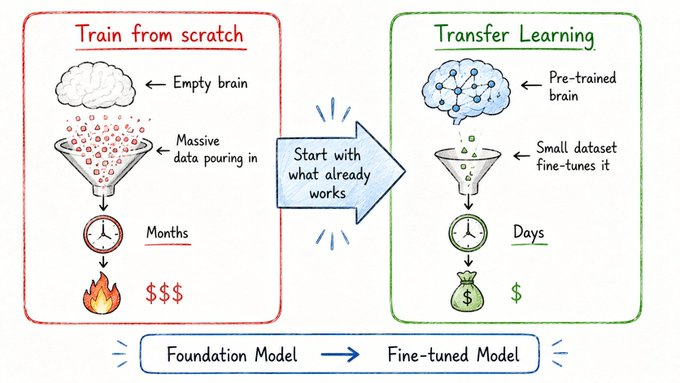

# Never Start From Scratch

## Concept 11 of 20 · Part 3: How AI models improve

Building a capable AI model from nothing is an enormous undertaking. It demands petabytes of data, months of compute time on thousands of specialised chips, and a budget that only a handful of organisations in the world can sustain. Transfer learning is the field's answer to that problem: rather than training a model from random initialisation, take one that has already been trained on a vast general task and adapt it to the specific task at hand. The adapted model inherits the general model's accumulated understanding of structure and meaning, and only the specialisation needs to be learned from scratch.

### What it is

Transfer learning is the practice of reusing learned representations from one task or domain as the starting point for another. The key intuition is that capability transfers. A model trained to predict the next word in billions of documents has, by necessity, developed internal representations of grammar, factual associations, reasoning patterns, and world knowledge — not because it was taught these things explicitly, but because they are the structure that makes good next-word predictions possible. A model trained on a different, narrower task can inherit all of that structure and redirect it.

The two-stage pattern that resulted — **pretraining** on a large general corpus followed by **adaptation** for a specific use — has become the dominant workflow in modern machine learning. [Howard and Ruder's ULMFiT paper](https://arxiv.org/abs/1801.06146) was among the first to demonstrate that this pattern works reliably for natural language: a single language model pretrained on a general corpus could be fine-tuned to state-of-the-art performance on text classification tasks across diverse domains. The transfer was not just convenient; it was genuinely better than training on the downstream task alone.

### How it works

Transfer learning relies on the observation that early layers of a deep neural network tend to learn general, broadly reusable features, while later layers become increasingly specific to the training task. In vision models, the early layers learn edges and textures, the middle layers learn shapes and parts, and only the final layers learn the categories the model was trained to distinguish. The same principle holds in language: early layers encode syntax, later layers encode semantics, and the final layers are tuned to whichever objective the model was trained on.

To transfer a model, the later layers — sometimes just the final classification head — are discarded or re-initialised, and the pretrained weights elsewhere are kept as a starting point. Training then continues on the new, smaller dataset. Because the model already has useful representations, it converges much faster and needs far less labelled data than a model trained from scratch.

[Raffel et al.'s T5 paper](https://arxiv.org/abs/1910.10683) pushed this to an extreme. T5 reframed every NLP task — translation, summarisation, question answering, classification — as a text-to-text problem, trained a single large model across all of them, and found that the pretrained representations transferred well not only between domains but between task types. The result was a unified framework that outperformed purpose-built systems on most benchmarks while requiring far less task-specific engineering.

### State of the art in 2026

Transfer learning is no longer a research technique — it is the default. Every major language model in production, from the publicly available open-weight models to the frontier systems accessed via API, follows the pretrain-then-adapt pipeline. The pretraining stage is performed once, at enormous cost, by the organisations that can afford it. The adaptation stage is performed repeatedly, cheaply, by anyone who wants to direct the model's capabilities toward a particular task.

The distinction between what is transferred and what is adapted has also sharpened. Pretraining instils general reasoning, factual knowledge, and linguistic capability. Adaptation shapes the model's behaviour, register, and domain expertise. Crucially, these are separable: the same pretrained model can be adapted into a legal assistant, a coding tool, and a children's tutor with relatively modest effort, because the underlying capability — the transferred knowledge — is shared across all three.

What has changed most between 2018 and 2026 is scale. Early transfer learning re-used models with millions of parameters. Current pretrained models have billions to hundreds of billions, and the representations they transfer are correspondingly richer.

### Why it matters

Transfer learning is the reason that capable AI systems are accessible to teams and individuals who could never afford to train a frontier model. The compute cost of pretraining is a sunk cost, paid once. Every adaptation inherits that investment. A research group with modest resources and a few hundred labelled examples can achieve results that would have been unattainable without the pretrained foundation. That shift — from capability as a luxury of scale to capability as a shared starting point — is one of the most consequential structural changes in the field.

### A common misconception

Transfer learning is sometimes described as the model "remembering" what it learned before. The mechanism is more concrete than that: the weights learned during pretraining are literally the initial values used when training begins on the new task. Nothing is recalled or retrieved — the representations are already encoded in the parameters. What training on the new task does is refine those representations, not trigger a memory.

---

_Next: [Fine-Tuning](312-fine-tuning.md) — how to teach a pretrained model your specific domain or format. Full sources in the [references](502-references.md)._
