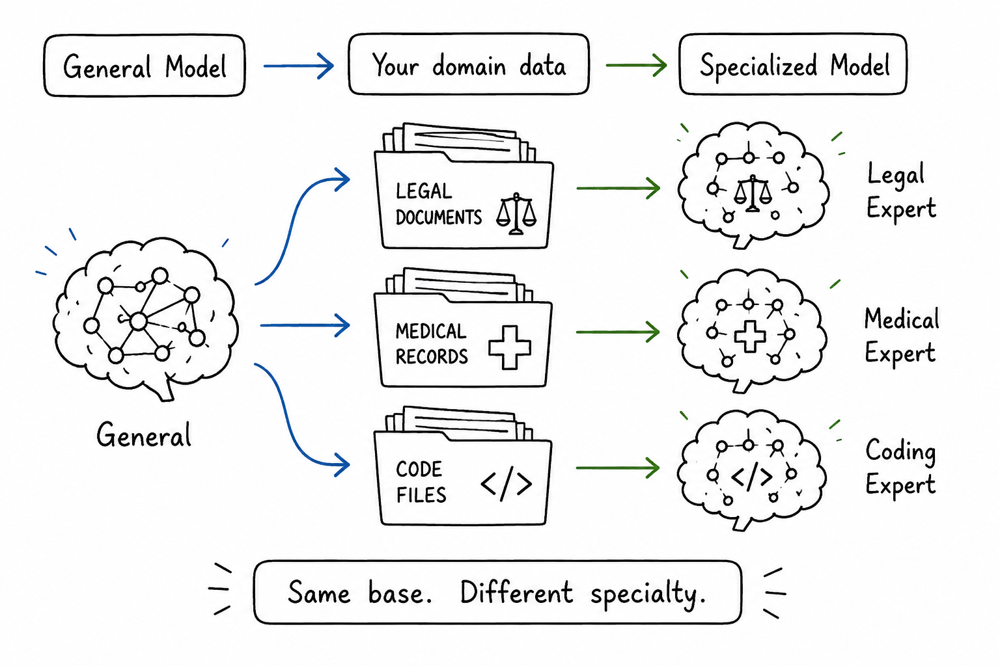

# Specialising a Generalist

## Concept 12 of 20 · Part 3: How AI models improve

A pretrained language model is an impressive but unwieldy thing. It has absorbed vast quantities of text and developed a rich internal representation of language, but left to its own devices it behaves like a next-word predictor — because that is exactly what it was trained to be. Fine-tuning is the step that shapes that raw capability into something purposeful: a model that answers questions, follows instructions, writes in a particular style, or speaks the language of a particular profession. Transfer learning is the idea; fine-tuning is how the idea is executed.

### What it is

Fine-tuning means continuing to train a pretrained model on a smaller, more focused dataset, using the same gradient-descent machinery that trained it in the first place. The model begins with the weights acquired during pretraining — which encode broad language understanding — and those weights are adjusted, slightly and selectively, to improve performance on the new task. Because the starting point is already strong, only a modest amount of additional data and compute is needed.

The term covers a range of techniques that differ in how much of the model is updated. In the simplest case, the entire model is trained end-to-end on the new data — every parameter moves. In more constrained approaches, the earlier layers are frozen and only the later layers (or a small new head) are trained, preserving the general representations while adapting the task-specific ones. Both are legitimate forms of fine-tuning; which is appropriate depends on how different the downstream task is from the pretraining objective and how much data is available.

### How it works

The canonical template for fine-tuning in natural language processing was established by [Devlin et al.'s BERT](https://arxiv.org/abs/1810.04805). BERT was pretrained on a large English corpus using two objectives: predicting masked tokens (masked language modelling) and predicting whether two sentences were adjacent (next-sentence prediction). The result was a model with strong representations of word meaning in context. Devlin et al. then showed that the same model, with only a small task-specific layer added on top and only a few epochs of fine-tuning on labelled examples, achieved state-of-the-art results across eleven NLP benchmarks simultaneously. The pretrained representations were general enough that the fine-tuning needed to do very little new learning — mostly just alignment.

There is an important distinction between two kinds of fine-tuning that are often conflated. **Task fine-tuning** — the BERT pattern — adjusts the model to perform a specific input-output mapping: classify this text, extract these spans, answer this question. The model's capabilities are reshaped toward the task, but the model's conversational behaviour is not directly changed. **Instruction fine-tuning**, by contrast, trains the model on examples of the form (instruction, desired response), teaching it to interpret and follow natural language directions. This is the step that turns a raw next-token predictor into something that feels like an assistant.

[Ouyang et al.'s InstructGPT paper](https://arxiv.org/abs/2203.02155) made this distinction concrete. GPT-3 in its base form was a capable predictor but did not reliably follow instructions or avoid unhelpful outputs. InstructGPT applied supervised fine-tuning on a dataset of human-written (prompt, response) pairs, producing a model that was substantially more useful and less erratic — even though the fine-tuned model was considerably smaller than the base model it improved upon. The lesson was that the _kind_ of training data matters as much as quantity: a few thousand high-quality instruction examples shaped behaviour more effectively than billions of tokens of raw text.

### State of the art in 2026

In 2026, virtually every deployed language model has been fine-tuned — typically multiple times, in sequence. The standard pipeline is: pretrain on a large general corpus; instruction-fine-tune on curated prompt-response pairs; then apply alignment techniques such as RLHF (Concept 13) to further shape helpfulness and safety. Each stage builds on the previous one.

Domain-specific fine-tuning has matured into a routine operation. Medical, legal, and scientific models are commonly produced by continuing to train a general-purpose foundation model on domain corpora, then instruction-fine-tuning on domain-specific tasks. The cost of this is dramatically lower than training from scratch, and the results reliably exceed both the untuned foundation model and smaller models trained entirely within the domain.

### Why it matters

Fine-tuning is the mechanism by which a single pretrained model can serve many different purposes. The pretraining cost is paid once; every fine-tuned variant inherits that investment. For organisations building AI-powered tools, this means the question is rarely "can we afford to train a model?" — it is "how do we fine-tune an existing one?" That shift has substantially lowered the barrier to building capable, specialised AI systems and made domain expertise in data curation as valuable as expertise in model architecture.

### A common misconception

Fine-tuning is often described as "teaching the model new information". In practice, it is closer to adjusting behaviour than instilling facts. A model fine-tuned on medical notes becomes more fluent in clinical language and more reliable at clinical tasks, but it does not reliably acquire new factual knowledge from the fine-tuning data in the way a human would from studying. Factual knowledge is better injected through retrieval at inference time (Concept 16) than baked in through fine-tuning.

---

_Next: [RLHF](313-rlhf.md) — how human preferences are turned into a training signal. Full sources in the [references](502-references.md)._
