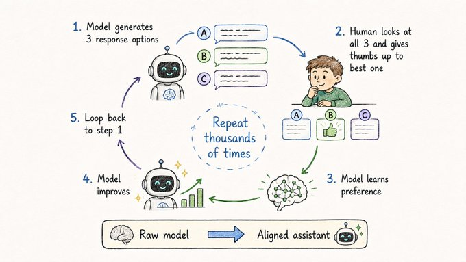

# Learning From Human Taste

## Concept 13 of 20 · Part 3: How AI models improve

Fine-tuning on instruction examples produces a model that follows directions. But following directions is not the same as being genuinely useful. A model can comply with instructions while being verbose, evasive, subtly misleading, or confidently wrong. The harder problem is teaching a model to produce outputs that people actually find good — helpful, honest, appropriately cautious, well-calibrated. That quality is difficult to specify in a loss function directly, but it is easy for humans to recognise. Reinforcement Learning from Human Feedback, RLHF, is the mechanism that converts human recognition into a training signal.

### What it is

RLHF is a training procedure in which human judgements about model outputs are used to shape a language model's behaviour. Rather than specifying the desired output explicitly — which would require writing down rules for every situation — RLHF learns a representation of human preferences from comparison data and then optimises the model against that representation.

The procedure is grounded in [Christiano et al.'s foundational work](https://arxiv.org/abs/1706.03741) on deep reinforcement learning from human preferences. That paper showed that a reinforcement learning agent could learn to behave well in complex environments purely from human judgements about which of two trajectories was better — without access to a hand-coded reward function. The language model case replaces the RL agent's trajectories with the model's text outputs, but the logic is identical.

### How it works

RLHF as applied to language models follows three steps.

First, a pretrained and instruction-fine-tuned model is used to generate pairs of responses to the same prompt. Human raters compare the two responses and indicate which they prefer, or rank a larger set. The result is a dataset of human preference comparisons — not absolute scores, but relative judgements.

Second, a separate **reward model** is trained on that comparison dataset. The reward model learns to predict which outputs humans prefer: given a prompt and a response, it produces a scalar score. This score is the operationalisation of "human taste".

Third, the language model is optimised using reinforcement learning — specifically, an algorithm called Proximal Policy Optimisation (PPO) — to produce outputs that score highly according to the reward model. A KL-divergence penalty keeps the fine-tuned model from drifting too far from the original instruction-tuned model, preventing it from learning to game the reward model with degenerate outputs.

[Ouyang et al.'s InstructGPT](https://arxiv.org/abs/2203.02155) applied this pipeline to GPT-3 and demonstrated that the resulting model was substantially preferred by human evaluators over the base model, despite being much smaller. Crucially, the improvement was not primarily in benchmark accuracy — it was in the qualities that make a model actually useful: following the spirit of instructions, declining to make things up, giving appropriately hedged answers.

### State of the art in 2026

RLHF in its classic form requires significant infrastructure: a separate reward model, a reinforcement learning loop, and a continuous supply of human preference labels. The cost and complexity have motivated simpler alternatives.

[Rafailov et al.'s Direct Preference Optimisation (DPO)](https://arxiv.org/abs/2305.18290) showed that the same alignment objective can be achieved without a separate reward model or RL loop at all. DPO reformulates preference learning as a supervised objective directly over the language model: the model is trained to increase the likelihood of preferred responses relative to dispreferred ones, using a loss function that implicitly captures the reward model's role. The result is substantially simpler to train and has become widely adopted as a drop-in replacement for the RLHF RL step.

In 2026, most frontier models use some variant of preference learning at the final alignment stage — whether the original RLHF pipeline, DPO, or one of several derived methods. The human feedback collection bottleneck remains real, but the scale of labelling infrastructure at major labs has grown accordingly.

### Why it matters

The models most people interact with — the helpful, conversational assistants that feel qualitatively different from raw language model outputs — are products of alignment training. Without it, a capable language model is unpredictable in its helpfulness and unreliable in its safety behaviour. RLHF and its descendants are the techniques that close the gap between "technically capable" and "actually useful to humans". Understanding that gap, and that it is deliberately engineered closed, changes how the outputs of these systems should be interpreted.

### A common misconception

RLHF is sometimes described as making models "agree with human values". The process is more specific and more limited than that: it makes models produce outputs that specific groups of human raters, in a specific rating process, at a specific point in time, judged as preferable. The values embedded in the resulting model are those of the rating pool and the guidelines they were given — not a universal human consensus. That distinction matters for understanding both the capabilities and the potential failure modes of aligned models.

---

_Next: [LoRA](314-lora.md) — how to fine-tune a billion-parameter model without a supercomputer. Full sources in the [references](502-references.md)._
