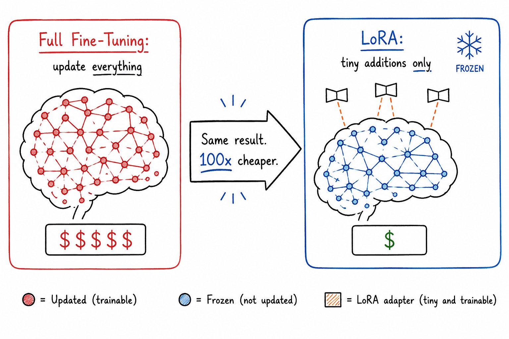

# Big Changes, Tiny Files

## Concept 14 of 20 · Part 3: How AI models improve

Fine-tuning a language model sounds straightforward until the arithmetic is done. A model with seven billion parameters stores each weight as a 16-bit floating-point number, which means the weights alone occupy roughly fourteen gigabytes. Training requires keeping not just the weights but gradients and optimiser state for every parameter — commonly three to four times the weight storage, pushing the total well past fifty gigabytes. That puts full fine-tuning of even a modest modern model beyond the reach of a single consumer GPU, and training a frontier-scale model requires a rack of the most expensive hardware available. Low-Rank Adaptation, LoRA, is the technique that breaks that constraint.

### What it is

LoRA is a parameter-efficient fine-tuning method that trains a small number of additional parameters rather than updating the full model. The key insight, from [Hu et al.'s 2021 paper](https://arxiv.org/abs/2106.09685), is that the changes a model needs to make during fine-tuning tend to have low intrinsic dimensionality — they can be well approximated by matrices of much lower rank than the original weight matrices.

Instead of modifying a weight matrix W directly, LoRA freezes W and trains two small matrices, A and B, such that the effective weight during forward passes is W + AB. If W has dimensions d × k, then A is d × r and B is r × k, where r — the rank — is a small number, typically 4, 8, or 16. The number of trainable parameters is r × (d + k) rather than d × k. For a typical attention layer with d = k = 4096, full fine-tuning of that layer trains about 16.7 million parameters; LoRA at rank 8 trains about 65,000 — a reduction of roughly 99.6%.

### How it works

At the start of LoRA fine-tuning, A is initialised randomly and B is initialised to zero, so AB is zero and the model begins from the original pretrained weights with no perturbation. As training proceeds, A and B are updated by gradient descent in the normal way; the frozen weights W receive no gradients and do not move. At inference time, the adapted weight W + AB can be computed once and the result used exactly like a standard weight matrix — no runtime overhead compared to the original model.

The adapter matrices A and B constitute the fine-tuned model's "delta" — everything learned beyond the base model. For a typical 7-billion-parameter base model fine-tuned with LoRA at rank 8, the adapter files are tens of megabytes rather than tens of gigabytes. Multiple adapters can be trained on the same base model for different tasks; switching between them at inference time is a matter of loading a different small file, with the base model remaining constant.

LoRA is typically applied to the query and value projection matrices in the transformer's attention layers, though it can be applied to any linear layer in the model. The choice of which layers to adapt and at what rank is a hyperparameter that affects both the quality and the cost of fine-tuning.

### State of the art in 2026

LoRA has become the default fine-tuning approach for practitioners working outside of large-scale compute environments — which is to say, most practitioners. Its adoption was accelerated by QLoRA, introduced by [Dettmers et al.](https://arxiv.org/abs/2305.14314), which combines LoRA with quantisation (Concept 15) to further reduce the memory required.

In QLoRA, the frozen base model weights are stored in 4-bit precision rather than 16-bit, cutting base model memory by a factor of four. The LoRA adapter weights are still trained and stored in higher precision. The result is that a 65-billion-parameter model — which would require approximately 130 gigabytes at 16-bit precision — can be fine-tuned on a single 48-gigabyte GPU. A 7-billion-parameter model can be fine-tuned on a consumer GPU with 24 gigabytes of memory. QLoRA made fine-tuning of genuinely capable large models accessible to individual researchers and small teams for the first time.

In 2026, variants and extensions of LoRA are in widespread use: rank-adaptive methods that select different ranks per layer, methods that extend LoRA to other modalities, and integrations into hosted fine-tuning APIs that abstract the implementation entirely. The base technique, however, remains the same low-rank decomposition introduced in the original paper.

### Why it matters

LoRA changed the economics of fine-tuning. Before it, the ability to specialise a large model was gated on access to substantial compute infrastructure. After it, fine-tuning became something an individual developer could do on hardware they already owned, or on a cloud instance costing a few dollars per hour. The downstream consequence is a proliferation of specialised models — adapted for specific languages, domains, styles, and tasks — that would not have existed under the economics of full fine-tuning.

### A common misconception

LoRA is sometimes described as a form of compression — as if the adapter is a compact encoding of the full fine-tuned model. It is not. The base model is unchanged, and the adapter only stores the delta. The full effective model is still the combination of both, and the base model must still be loaded. What LoRA compresses is the _incremental cost_ of adaptation, not the model itself.

---

_Next: [Quantisation](315-quantisation.md) — how storing weights at lower precision lets large models run on modest hardware. Full sources in the [references](502-references.md)._
