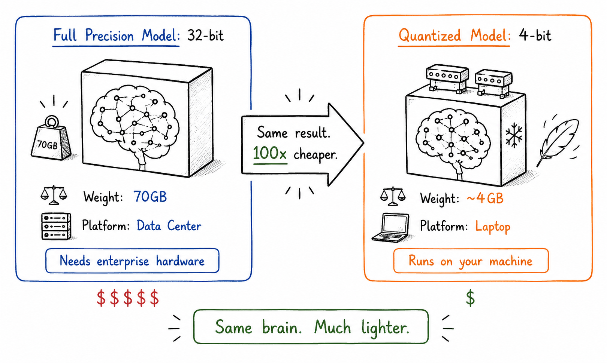

# Shrinking the Giant

## Concept 15 of 20 · Part 3: How AI models improve

A language model with seven billion parameters, stored in the 16-bit floating-point format that has become standard for training, occupies roughly fourteen gigabytes of memory before the inference machinery — the key-value cache, activations, and framework overhead — is added. A seventy-billion-parameter model needs close to 140 gigabytes. The most capable frontier models are larger still. Even with falling hardware costs, running models of this scale requires expensive specialised hardware that is far beyond what most users and developers have access to. Quantisation addresses that problem directly: by representing each weight with fewer bits, the model shrinks, and with it the hardware required to run it.

### What it is

Quantisation is the process of representing a model's weights — and optionally its activations — at lower numerical precision than they were trained at. A standard floating-point number uses 32 bits (FP32) or 16 bits (FP16 or BF16). Quantisation reduces this to 8 bits, 4 bits, or sometimes fewer, typically by mapping each float to an integer on a fixed scale. The result is a model that occupies a fraction of the original memory, runs faster on hardware that handles integers efficiently, and draws less power — at the cost of some accuracy, which in practice is often small.

The central technical challenge is that naive rounding of weights to lower precision introduces error, and that error accumulates across the many matrix multiplications in a transformer. The research effort in quantisation is largely directed at minimising this accuracy cost: choosing scales and zero-points well, identifying which layers and channels are sensitive, and handling the outlier values that cause disproportionate quantisation error.

### How it works

[Dettmers et al.'s LLM.int8()](https://arxiv.org/abs/2208.07339) was an important step in making 8-bit quantisation practical for large language models. The key finding was that transformer models contain a small number of very large-magnitude "outlier" activations concentrated in specific dimensions — and that naively quantising these dimensions causes severe accuracy degradation. LLM.int8() handles this by detecting the outlier dimensions and processing them at full precision while quantising the rest to 8-bit integers, achieving near-lossless 8-bit inference without any retraining of the original model.

[Frantar et al.'s GPTQ](https://arxiv.org/abs/2210.17323) extended this to 4-bit precision using a post-training quantisation approach based on second-order weight information. GPTQ quantises the weights of each layer while minimising the reconstruction error on a small calibration dataset, using an efficient algorithm that processes weights in groups. The result is that models quantised to 4 bits with GPTQ retain most of their accuracy — typically within a percentage point or two of the FP16 baseline on standard benchmarks — while occupying one-quarter of the original memory.

These two techniques together made a qualitative difference to what hardware large models require. A 70-billion-parameter model quantised to 4 bits fits in roughly 35 gigabytes — accessible on a pair of consumer GPUs or a single high-end workstation card. A 7-billion-parameter model at 4 bits fits in about 4 gigabytes — within reach of most modern laptops with a dedicated GPU.

### State of the art in 2026

The combination of quantisation and LoRA, as packaged in [QLoRA](https://arxiv.org/abs/2305.14314), represents the state of the art for accessible fine-tuning: the base model is quantised to 4 bits to minimise memory, while the LoRA adapter weights are trained and maintained in 16-bit precision. This allows fine-tuning of models that would otherwise require far more GPU memory than a single card can provide.

Beyond QLoRA, quantisation research in 2026 spans a range of further methods — 2-bit and 3-bit schemes for extreme compression, hardware-aware quantisation pipelines for specific chip architectures, and quantisation methods that apply different precisions to different layers or components based on their measured sensitivity. The practical benchmark has shifted from "can we quantise this model?" to "what precision offers the best accuracy-performance trade-off for this deployment target?"

Quantised models are also a first-class deployment format in inference runtimes such as llama.cpp, which can run quantised models on CPU-only hardware, including ordinary laptops with no GPU at all. The capability threshold for running a capable language model locally has fallen to the point where it fits on hardware that most people already own.

### Why it matters

Quantisation is what makes large models accessible outside of data centres. Without it, capable models exist only as cloud services, and every inference is a network call to someone else's hardware. With it, models can be downloaded, run locally, and deployed in environments where cloud connectivity is unavailable, expensive, or inadvisable for privacy reasons. That shift has practical consequences for how AI capability is distributed — both who can use it and who can control the conditions under which it is used.

### A common misconception

Quantisation is sometimes described as "degrading" a model. The framing is accurate but often overstated. A 4-bit quantised version of a 70-billion-parameter model typically outperforms a full-precision version of a 7-billion-parameter model on most benchmarks — the accuracy cost of quantisation on a large model is generally smaller than the accuracy gap between model sizes. When choosing between a smaller model at full precision and a larger model quantised, the larger quantised model is usually the better choice.

---

_Next: [RAG](416-rag.md) — how models retrieve and use external knowledge at inference time. Full sources in the [references](502-references.md)._
