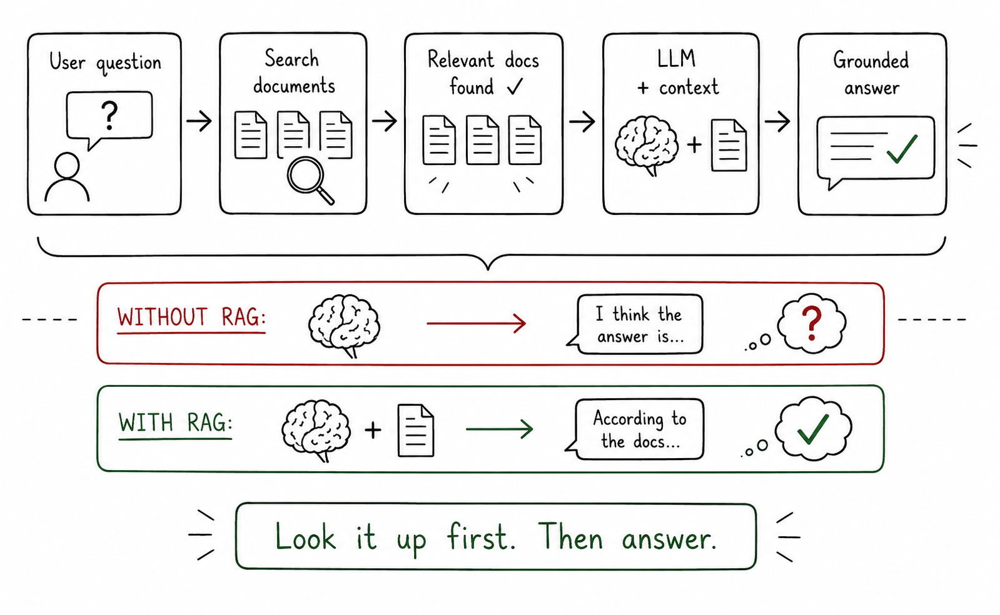

# Open-Book AI

## Concept 16 of 20 · Part 4: How real AI systems are built

Large language models are, at bottom, very fluent guessers. They learn patterns across vast text corpora during training, compress that learning into billions of weights, and then answer questions from memory at inference time. The trouble is that memories fade, go stale, and fill in gaps with plausible-sounding nonsense — the hallucination problem explored in Concept 9. Retrieval-Augmented Generation, introduced by [Lewis et al. (2020)](https://arxiv.org/abs/2005.11401), repairs this by letting the model look things up before it answers: a knowledge base is consulted, relevant documents are retrieved, and the model reasons over real, current text rather than guessing from compressed training data.

### What it is

RAG is an architectural pattern that pairs a language model with a retrieval system. Instead of generating purely from parametric memory — the weights baked in during training — the model is given a set of retrieved passages as additional context, then asked to produce an answer grounded in that material. The knowledge base can be anything: product documentation, legal filings, medical records, a company's internal wiki. Crucially, the knowledge base can be updated at any time without retraining the model, which makes RAG the standard approach for keeping AI systems current at reasonable cost.

The name reflects the three stages. **Retrieval**: a query is issued against the knowledge base and the most relevant chunks are pulled back. **Augmentation**: those chunks are inserted into the prompt alongside the original question. **Generation**: the model reads the augmented prompt and produces a response. Lewis et al. framed this as a unified probabilistic model — marginalising over retrieved documents — though in most production deployments the stages are implemented as a straightforward pipeline rather than a tightly coupled probabilistic system.

### How it works

Two things need to happen reliably for RAG to work: the right documents must be found, and the model must actually use them.

Finding the right documents is the retrieval problem. Modern RAG systems almost always use dense retrieval: every document in the knowledge base is passed through an embedding model (Concept 3), which converts it to a high-dimensional vector capturing its meaning. When a query arrives, it is embedded the same way and the system finds the document vectors nearest to the query vector — the closest matches in meaning, not in keyword overlap. The approximate nearest-neighbour search that makes this fast at scale is discussed in Concept 17.

Once the relevant chunks land in the prompt, they arrive as plain text. The model is instructed — through a system prompt or template — to base its answer on the provided passages and to acknowledge when the retrieved material does not contain enough information to answer. This instruction-following is not guaranteed; poorly designed RAG pipelines can still hallucinate by ignoring retrieved context or blending it with invented detail. Good system-prompt design and careful chunking strategy are as important as the retrieval mechanism itself.

The retrieval mechanism that underpins most production deployments is Hierarchical Navigable Small World (HNSW) indexing, described by [Malkov and Yashunin (2016)](https://arxiv.org/abs/1603.09320), which organises vectors into a layered graph that enables sub-linear search time even over tens of millions of documents. The vector database tier (Concept 17) is what exposes HNSW search to the application layer.

### State of the art in 2026

RAG has moved from research novelty to default architecture for enterprise AI in a few years. The original Lewis et al. formulation retrieved whole documents; production systems now chunk documents into smaller passages — typically a few hundred tokens — to improve retrieval precision. Chunk overlap, metadata filtering, and re-ranking (running a smaller model to rescore the top-k retrieved chunks before passing them to the generator) are standard refinements.

Hybrid retrieval, combining dense vector search with traditional keyword search (BM25), is common: some queries are answered better by exact keyword matching, others by semantic similarity, and ensemble approaches hedge the risk. Context windows have grown large enough (some models accept hundreds of thousands of tokens) that it is tempting simply to stuff the entire knowledge base into the prompt, but retrieval remains preferable for large corpora where cost, latency, and focus on relevant material all matter.

### Why it matters

RAG closes the gap between a model's training cut-off and the real world. A model trained through late 2024 can still answer accurately about events in 2026 if those events are in the knowledge base. It also makes AI systems auditable: a well-built RAG pipeline can surface the exact passages it retrieved, letting an operator verify the source of every claim. That citation trail is increasingly expected in regulated industries and enterprise deployments. Where fine-tuning (Concept 12) changes what a model believes, RAG changes what it can see — and it does so without touching the model weights at all.

### A common misconception

RAG is sometimes described as "giving the model internet access". In the general case that is not accurate. A RAG system retrieves from a defined, curated knowledge base; what goes into that base is a deliberate choice. Retrieval from the live web is one possible instantiation — and some production products do exactly that — but most enterprise RAG deployments retrieve from private, controlled corpora precisely to keep the model's knowledge within auditable bounds.

---

_Next: [Vector Databases](417-vector-databases.md) — how meaning-based search works at scale. Full sources in the [references](502-references.md)._
