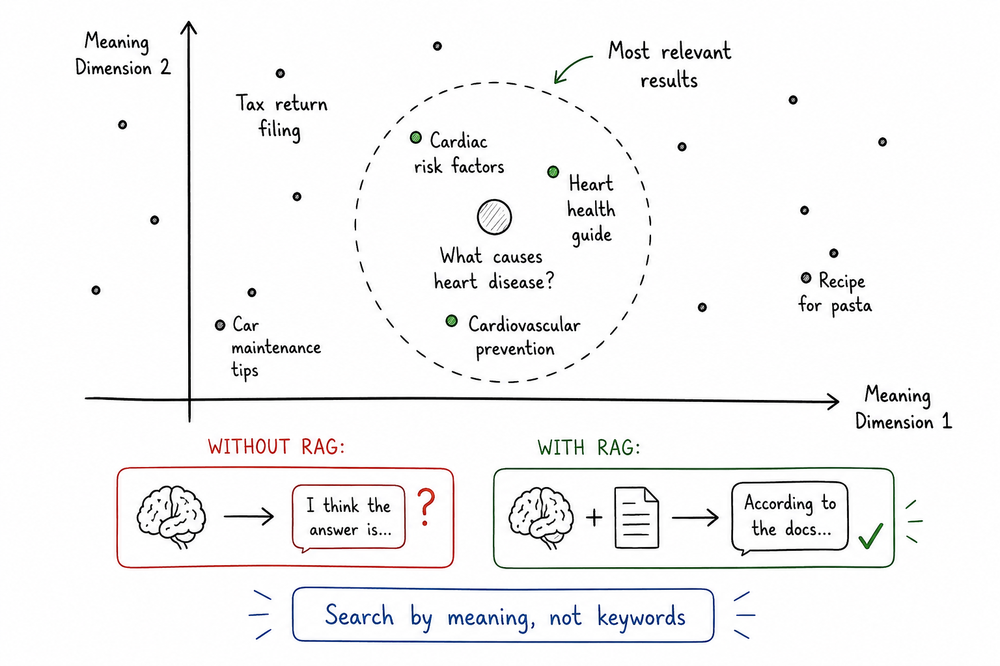

# Search by Meaning, Not Keywords

## Concept 17 of 20 · Part 4: How real AI systems are built

Traditional search engines match words. Type "automobile fault" into a keyword index and the results contain those exact words, but a document about "car malfunction" may not appear at all. Meaning and vocabulary are separate, and keyword search cannot bridge them. Embeddings (Concept 3) solved that separation by encoding meaning as vectors in high-dimensional space — documents with similar meaning land close together regardless of the words they use. Vector databases are the infrastructure built around that insight: they store millions of embedding vectors and retrieve the nearest ones to a query embedding in milliseconds, making the semantic search that RAG (Concept 16) depends on practical at scale.

### What it is

A vector database is a storage and retrieval system optimised for high-dimensional floating-point vectors. The core operation is nearest-neighbour search: given a query vector, return the k stored vectors closest to it under some distance metric, typically cosine similarity or Euclidean distance. Everything else in a vector database — persistence, filtering by metadata, integration with application code, scalability — exists to make that core operation reliable and fast.

The challenge is that naive nearest-neighbour search does not scale. Computing the exact distance from a query vector to every stored vector takes time proportional to the number of vectors in the database. Over millions or billions of documents, that is far too slow for an interactive application. The solution is to accept a small approximation — not always returning the exact nearest neighbours, but returning very good ones — using an index that structures the vector space for efficient traversal. This is approximate nearest-neighbour (ANN) search, and it is the technical heart of the vector database tier.

### How it works

The dominant indexing algorithm in production vector databases is [Hierarchical Navigable Small World (HNSW)](https://arxiv.org/abs/1603.09320), introduced by Malkov and Yashunin. HNSW builds a multi-layer graph over the vector space. The top layer is a sparse long-range graph; lower layers are progressively denser and more local. At query time, search starts at the top layer — covering large distances quickly — then descends through finer layers, converging on the approximate nearest neighbours. The result is sub-linear query time: searching a million-vector index takes roughly the same time as searching a hundred-thousand-vector index, rather than ten times as long.

Building the index is more expensive than building a keyword inverted index, and the graph must be rebuilt or incrementally updated when the vector set changes, but those costs are borne at indexing time, not at query time. In practice, HNSW achieves recall rates above 95% — meaning it returns the true nearest neighbour more than nineteen times in twenty — at query latencies of single-digit milliseconds.

The same underlying principle drives several concrete implementations. [FAISS (Facebook AI Similarity Search)](https://github.com/facebookresearch/faiss) is a widely used open-source library that provides multiple ANN index types and runs efficiently on both CPU and GPU; it is the embedding layer inside several commercial vector databases. [pgvector](https://github.com/pgvector/pgvector) is a Postgres extension that adds a vector column type and HNSW (and IVFFlat) indexes directly into a relational database, allowing teams to perform vector search without a separate infrastructure tier. The pragmatic value of pgvector is considerable: an existing Postgres deployment can serve both structured relational queries and semantic vector search from a single database, with transactional consistency across both.

### State of the art in 2026

Vector database adoption tracks RAG adoption closely. Purpose-built distributed vector databases handle billions of vectors, support hybrid search (combining dense retrieval with keyword BM25 scoring), and offer metadata filtering so that semantic search can be restricted to a subset of the corpus — for instance, documents belonging to a particular customer or dated within a particular window. Quantisation of vectors (a relative of the weight quantisation in Concept 15) reduces memory footprint by representing each dimension with fewer bits, enabling larger indexes to fit in available RAM at some cost to recall.

Embedding models and vector indexes co-evolve: as embedding dimension counts grow — several thousand dimensions are common for state-of-the-art models — index algorithms must handle higher-dimensional spaces without their performance degrading. HNSW scales reasonably well with dimension count, which is part of why it has remained the default.

### Why it matters

Vector databases make the semantic layer of AI systems queryable at production scale. Without them, RAG is a proof-of-concept; with them, it is a deployable product. The same infrastructure that retrieves context for a language model also powers recommendation engines, duplicate detection, image search, and any other task that reduces to "find things similar to this". The move from keyword indexes to vector indexes is, at a deeper level, the move from searching for what was written to searching for what was meant — a shift that touches every information-retrieval application.

---

_Next: [AI Agents](418-ai-agents.md) — when models stop answering and start doing. Full sources in the [references](502-references.md)._
