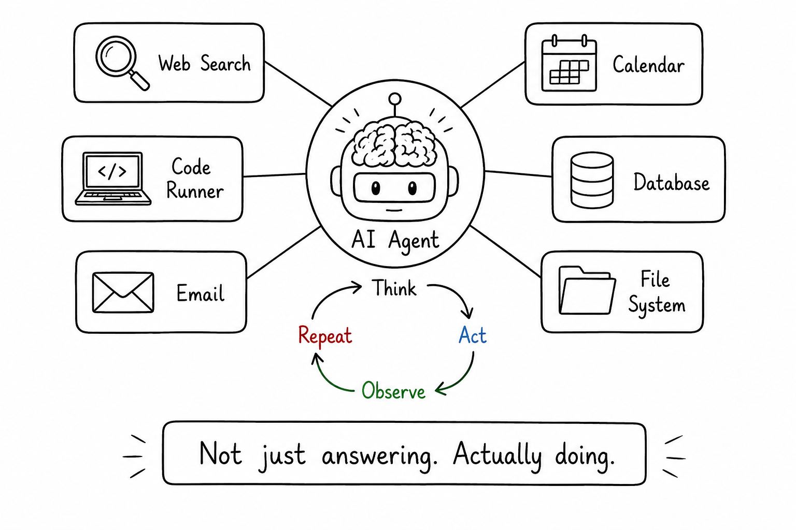

# From Answering to Doing

## Concept 18 of 20 · Part 4: How real AI systems are built

A plain language model is stateless and single-shot: it reads a prompt, produces a response, and stops. That is sufficient for answering a question or drafting a document, but it cannot complete a task that requires multiple steps, decisions based on intermediate results, or actions that affect the world — booking a flight, running a batch of tests, querying a database and summarising the output. AI agents close that gap by wrapping a model in a loop: the model reasons about what to do, takes an action using a tool, observes the outcome, updates its understanding, and repeats until the goal is met. The shift is from responding to pursuing.

### What it is

An AI agent is a system in which a language model operates iteratively, with access to tools that extend its reach beyond generating text. Tools might include web search, a code interpreter, file read/write operations, API calls, or RAG retrieval (Concept 16). The model decides which tool to invoke and with what arguments; the tool runs and returns a result; the model incorporates the result into its next step. This loop continues until the model judges the goal achieved, hits a stopping condition, or encounters an error it cannot resolve.

The canonical framework is **ReAct** — Reasoning and Acting — introduced by [Yao et al. (2022)](https://arxiv.org/abs/2210.03629). ReAct structures each step of the loop as an explicit interleaving of thought ("I need to find the current population of the city") and action ("search: current population Auckland 2026"), followed by observation of the result. Making the reasoning visible within the loop — rather than having the model silently decide — improves reliability and makes failures easier to diagnose.

### How it works

Tool use is the mechanical core of an agent. The model is provided with descriptions of available tools in its context — their names, what they do, and what arguments they accept. Modern frontier models are trained to generate structured tool-call outputs rather than free text when they decide to invoke a tool, so the calling code can parse the output reliably and dispatch the right function. [Schick et al.'s Toolformer (2023)](https://arxiv.org/abs/2302.04761) showed that models can learn this skill from relatively few annotated examples of API calls inserted into training text, and that it generalises to tools not seen during training — a key property for practical deployment.

Once a tool returns a result, it is appended to the model's context and the loop continues. This means agent tasks consume context window progressively; a long multi-step task can exhaust the available window, which is one reason context management is a live research and engineering problem. It also means every step adds latency and cost: an agent that makes ten tool calls before answering takes ten times the network round-trips of a single-shot response.

[Anthropic's guidance on building effective agents](https://www.anthropic.com/research/building-effective-agents) is direct on the trade-offs: agents offer flexibility for genuinely open-ended tasks, but they trade latency, cost, and reliability for that flexibility. A fixed pipeline that does the same thing every time is preferable when the task is well-defined enough to script. The recommendation is to reach for agents when the shape of the problem genuinely cannot be known in advance, and to keep agent loops as short and bounded as the task permits.

### State of the art in 2026

Multi-agent architectures — networks of specialised agents that delegate to one another — are in wide use for complex workflows. An orchestrator agent breaks a large goal into sub-tasks and assigns them to specialist agents (a research agent, a coding agent, a summarisation agent); results propagate back up. This improves parallelism and lets each agent carry a focused context, but it multiplies the failure modes: a wrong delegation decision by the orchestrator compounds through the chain.

Agent reliability remains an active area. Models can get stuck in loops, take unintended irreversible actions (sending an email, deleting a file), or confidently pursue a misunderstood goal. Human-in-the-loop checkpoints — pausing for confirmation before consequential actions — are a standard mitigation in production systems where errors are costly.

### Why it matters

The practical boundary of AI systems moved when agents arrived. Tasks that previously required a human to sit at the keyboard and run each step — research, code generation with test-and-fix cycles, data extraction and transformation — can now be delegated to an agent loop. That matters enormously for productivity, but it also raises new questions about oversight and reversibility. An agent that can act has a different risk profile than a model that can only talk, and the engineering discipline around agent systems — clear tool permissions, bounded action spaces, audit logs — is as important as the model capability underneath.

### A common misconception

Agents are often discussed as if autonomy is inherently desirable. The more capable the model, the reasoning goes, the more freedom it should have. In practice, the opposite heuristic is often safer: tighter scope, fewer allowed tools, and explicit confirmation gates make agents more reliable and their failures easier to recover from. Autonomy is a design parameter to be chosen deliberately, not a property to maximise.

---

_Next: [Chain of Thought](419-chain-of-thought.md) — why reasoning aloud makes models more accurate. Full sources in the [references](502-references.md)._
