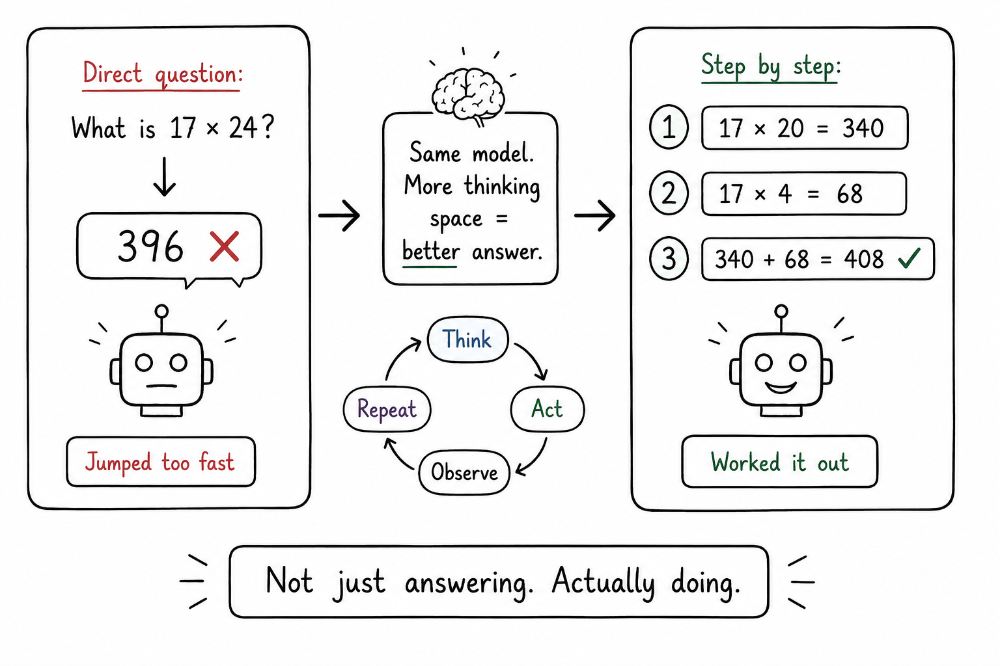

# Showing the Working

## Concept 19 of 20 · Part 4: How real AI systems are built

Ask a model a maths problem and instruct it to give the answer immediately; it often gets it wrong. Ask the same model to work through the problem step by step before answering; it often gets it right. The improvement is not cosmetic — the intermediate reasoning steps change the computation the model performs, not just the presentation. This is chain-of-thought prompting: a technique that elicits better reasoning by making the process of thinking explicit, and one of the highest-leverage prompting ideas to emerge from language model research.

### What it is

Chain-of-thought (CoT) prompting is a technique in which the model is guided — through prompt design or training — to produce a sequence of intermediate reasoning steps before arriving at a final answer. Rather than mapping directly from question to answer, the model writes out its working: identifying sub-problems, performing intermediate calculations, checking its own logic. The final answer follows from that trace. The critical finding, reported by [Wei et al. (2022)](https://arxiv.org/abs/2201.11903), is that this intermediate trace is not merely decorative — it materially improves accuracy on arithmetic, symbolic reasoning, and multi-step commonsense problems, particularly for larger models.

The improvement compounds with task complexity. On simple single-step problems, CoT adds little. On problems requiring four or five reasoning steps, the accuracy gap between direct answering and chain-of-thought can be large. The working hypothesis is that generating each step constrains the probability distribution over the next step, keeping the model on track rather than allowing it to jump to a plausible but wrong conclusion.

### How it works

The original Wei et al. formulation used few-shot examples: each prompt included several solved problems where a chain of reasoning was written out explicitly, and the model learned to follow the same pattern. Providing three to eight worked examples was sufficient to elicit extended reasoning across a range of task types.

A leaner variant — zero-shot chain-of-thought — was established by [Kojima et al. (2022)](https://arxiv.org/abs/2205.11916): simply appending the phrase "Let's think step by step" to the question, with no examples at all, elicits a reasoning trace in many models. The result was striking because it demonstrated that the reasoning capability was present in the model's weights from pre-training and required only a minimal prompt signal to surface. The phrase is now a standard baseline in prompting practice.

Self-consistency, introduced by [Wang et al. (2022)](https://arxiv.org/abs/2203.11171), extends the technique further. Instead of generating one reasoning trace and taking its answer, the model generates several independent traces — sampling at higher temperature to produce diverse reasoning paths — and the final answer is determined by majority vote across the traces. The intuition is that a correct answer is more likely to be reached by multiple independent reasoning paths than an incorrect one, which tends to arise from a specific wrong turn. Self-consistency improves accuracy over single-trace CoT on most benchmarks, at the cost of multiple inference calls.

### State of the art in 2026

Chain-of-thought is now baked into many frontier models rather than elicited purely through prompting. Models trained with reinforcement learning over reasoning traces — where the reward signal is applied to the complete trace, not just the final answer — develop more reliable and structured chains. The boundary between "prompting technique" and "trained behaviour" has blurred: a model that has learned to reason by showing its working no longer needs the "step by step" instruction, because the pattern is part of its generation strategy.

Extended thinking modes, where a model allocates additional compute to an internal reasoning pass before producing its visible response, are an architectural expression of the same idea. The reasoning trace may or may not be shown to the user, but its function is the same: decomposing a hard problem into steps that the model can handle sequentially.

### Why it matters

Chain-of-thought is one of the clearest examples of capability emerging from mechanism rather than scale alone. The underlying model weights did not change; the prompting strategy unlocked behaviour that was latent. That lesson generalises: how a problem is framed — what reasoning structure is made available to the model — matters as much as the model's raw capacity. For practitioners, CoT is the first thing to reach for when a capable model is giving wrong answers on reasoning-heavy tasks. For researchers, it opened the question of what other latent capabilities exist in large models, waiting for the right prompting approach to surface them.

### A common misconception

It is tempting to read a chain-of-thought trace as the model's actual internal reasoning — a faithful log of how it arrived at the answer. It is not. The trace is generated text, subject to the same token-prediction process as any other output. The model does not have a separate symbolic reasoning engine whose steps are being transcribed; the trace is part of the forward pass, not a window into a distinct process. This matters when the trace looks confident and coherent but leads to a wrong answer: the appearance of rigorous reasoning is not a guarantee of correct reasoning.

---

_Next: [Diffusion Models](420-diffusion-models.md) — how AI generates images from noise. Full sources in the [references](502-references.md)._
