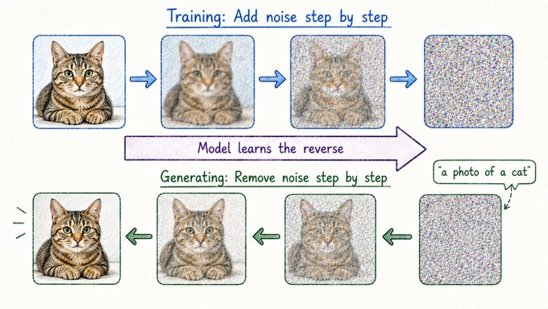

# Sculpting Images From Noise

## Concept 20 of 20 · Part 4: How real AI systems are built

Every concept in this guide up to this point concerns language: tokens, attention, context windows, reasoning traces. But modern AI does not only produce text. Image generation — create a painting in a given style, render a described scene, inpaint a missing region of a photograph — is now everyday capability, and the mechanism behind it is quite unlike anything in the language stack. Diffusion models generate images by learning to reverse a process of gradual destruction, turning random static into coherent pictures one small step at a time.

### What it is

A diffusion model is a generative model trained by corrupting data and learning to restore it. During training, a clean image has Gaussian noise added to it in a sequence of small steps until nothing of the original remains — it has become pure static. The model learns the reverse of this process: given a partially noisy image at step t, predict the slightly less noisy image at step t−1. That is all it is trained to do. Generation, then, is simply running the reverse process from scratch: start with random noise (step T), apply the learned denoising function T times, and arrive at a coherent image.

The foundational paper is [Ho, Jain, and Abbeel's Denoising Diffusion Probabilistic Models (DDPM, 2020)](https://arxiv.org/abs/2006.11239). DDPM established the mathematical framework — casting both the forward noising process and the learned reverse process as Markov chains — and demonstrated that the approach could produce high-quality image samples. Prior generative approaches, including Generative Adversarial Networks, required training two networks in competition; diffusion models train a single network with a stable maximum-likelihood objective, which made them substantially easier to scale.

### How it works

The denoising model is a neural network — typically a U-Net architecture with attention layers — that takes a noisy image and a timestep embedding as inputs and predicts either the original clean image or the noise that was added. The timestep tells the model how much noise is present, which changes the nature of the denoising task at each step: early steps (high noise) must recover coarse structure; later steps (low noise) must refine fine details.

Text conditioning is added by passing a text embedding through cross-attention layers in the U-Net: the model attends to the encoded prompt at each denoising step, biasing the generation toward the described content. This is how "a photograph of a red fox in a snowy forest" becomes a constraint on the image rather than just a label.

Generating in pixel space over a full-resolution image is expensive because the U-Net must process large tensors for every denoising step, and hundreds of steps are needed for quality results. Latent diffusion, the approach underlying Stable Diffusion, addresses this directly: a variational autoencoder first compresses the image into a smaller latent representation — typically eight times smaller in each spatial dimension — and the diffusion process operates entirely in that compressed space. Only the final step decodes the latent back to pixels. [Rombach et al. (2022)](https://arxiv.org/abs/2112.10752) showed that latent diffusion matches or exceeds pixel-space quality at a fraction of the compute, which is why it became the default architecture for open and commercial image generation models alike.

[Lilian Weng's reference post](https://lilianweng.github.io/posts/2021-07-11-diffusion-models/) gives a thorough mathematical walkthrough of the score-matching and variational perspectives that underpin the training objective.

### State of the art in 2026

Text-to-image models are capable of photorealistic output across a broad range of subjects, styles, and compositions. Consistency — keeping a character, object, or style coherent across multiple generated images — has improved substantially through fine-tuning techniques adapted from the language side (Concept 12). Video generation extends the same diffusion framework into the temporal dimension: a denoising model learns to produce sequences of frames rather than single images, with attention mechanisms enforcing consistency across time.

Inference speed has improved through distillation: a student model is trained to produce the same output as a full diffusion chain in far fewer steps, sometimes as few as one or four, making real-time interactive generation practical on consumer hardware.

### Why it matters

Diffusion models demonstrated that the generative capability that emerged in language through transformers could be replicated in vision through a completely different mechanism. That convergence — transformers for language, diffusion for images, and increasingly hybrid architectures for video and audio — is the shape of the current generation of AI products. Understanding diffusion means understanding why image generation works at all, why it produces coherent structure rather than random artefacts, and what "sampling" means in a visual context. It also closes the loop on the noise metaphor: the way diffusion adds and then removes noise is, at a structural level, related to how a language model navigates the space of possible tokens — both are processes of gradually reducing uncertainty toward a coherent output.

---

_Next: [Recap](501-recap.md) — how the four parts fit together into one picture. Full sources in the [references](502-references.md)._
